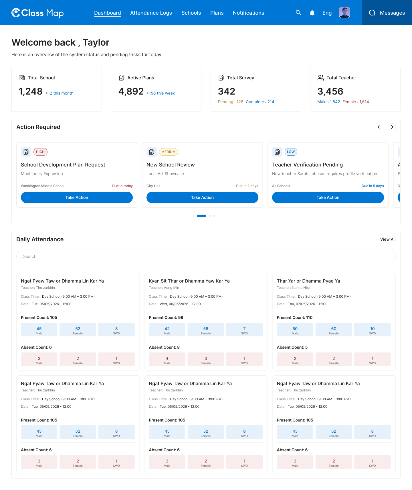

# Dashboard Overview – Dashboard



## Flow

```
Admin logs in
     |
     v
GET /api/v1/dashboard/overview   <-- summary stats + action-required items
     |
     v
GET /api/v1/dashboard/attendance  <-- daily attendance cards
```

## Endpoints

- [GET `/api/v1/dashboard/overview`](#1-get-dashboard-overview) — Summary stats and action-required items
- [GET `/api/v1/dashboard/attendance`](#2-get-dashboard-daily-attendance) — Daily attendance list across all schools

---

### 1. Get Dashboard Overview
**GET** `/api/v1/dashboard/overview`

**Headers**

| Key | Value | Required |
|---|---|---|
| `Authorization` | `Bearer {{access_token}}` | Yes |
| `Content-Type` | `application/json` | Yes |
| `X-Request-ID` | `<uuid>` | Yes |

**Response – 200 OK**

```json
{
  "success": true,
  "data": {
    "summary": {
      "total_school": 1248,
      "total_school_change": -12,
      "active_plans": 4892,
      "active_plans_change": 1050,
      "total_survey": 342,
      "survey_pending": 125,
      "survey_complete": 214,
      "total_teacher": 3456,
      "teacher_male": 1343,
      "teacher_female": 1374,
      "teacher_swd": 14
    },
    "action_required": [
      {
        "id": "act_001",
        "type": "SCHOOL_DEVELOPMENT_PLAN",
        "priority": "high",
        "title": "School Development Plan Request",
        "school_name": "Lincoln Elementary School",
        "days_ago": 3,
        "action_url": "/schools/sch_001/plans/plan_001"
      },
      {
        "id": "act_002",
        "type": "NEW_SCHOOL_REVIEW",
        "priority": "medium",
        "title": "New School Review",
        "school_name": "Oakridge Elementary",
        "days_ago": 1,
        "action_url": "/schools/sch_002"
      },
      {
        "id": "act_003",
        "type": "TEACHER_VERIFICATION",
        "priority": "low",
        "title": "Teacher Verification Pending",
        "description": "New teacher profile requires profile verification",
        "action_url": "/schools/sch_003/teachers/tch_001"
      }
    ]
  },
  "meta": null,
  "error": null,
  "message": "Successfully"
}
```

**Response – 4xx / 5xx**

| Status | Error Code | Description |
|---|---|---|
| `401` | `UNAUTHORIZED` | Missing or invalid token |
| `403` | `FORBIDDEN` | Insufficient role |
| `429` | `RATE_LIMIT_EXCEEDED` | Rate limit exceeded |
| `500` | `INTERNAL_SERVER_ERROR` | Unexpected server fault |

---

### 2. Get Dashboard Daily Attendance
**GET** `/api/v1/dashboard/attendance`

**Headers**

| Key | Value | Required |
|---|---|---|
| `Authorization` | `Bearer {{access_token}}` | Yes |
| `Content-Type` | `application/json` | Yes |
| `X-Request-ID` | `<uuid>` | Yes |

**Query Parameters**

| Parameter | Type | Required | Description |
|---|---|---|---|
| `page` | integer | No | Page number (default: 1) |
| `per_page` | integer | No | Items per page (default: 10) |

**Response – 200 OK**

```json
{
  "success": true,
  "data": [
    {
      "id": "att_001",
      "school_name": "Ngat Pyae Taw or Dhamma Lin Kar Ya",
      "teacher_name": "Thu Zarkhin",
      "class_time": "Day School (9:00 AM - 3:00 PM)",
      "date": "2026-05-05T12:00:00Z",
      "present_count": {
        "male": 45,
        "female": 52,
        "swd": 8,
        "total": 105
      },
      "absent_count": {
        "male": 3,
        "female": 2,
        "swd": 1,
        "total": 6
      }
    }
  ],
  "meta": {
    "page": 1,
    "per_page": 10,
    "total": 42
  },
  "error": null,
  "message": "Successfully"
}
```

**Response – 4xx / 5xx**

| Status | Error Code | Description |
|---|---|---|
| `401` | `UNAUTHORIZED` | Missing or invalid token |
| `403` | `FORBIDDEN` | Insufficient role |
| `429` | `RATE_LIMIT_EXCEEDED` | Rate limit exceeded |
| `500` | `INTERNAL_SERVER_ERROR` | Unexpected server fault |

## Error Codes

| Code | HTTP Status | Description |
|---|---|---|
| `UNAUTHORIZED` | 401 | Missing or invalid token |
| `FORBIDDEN` | 403 | Insufficient role |
| `RATE_LIMIT_EXCEEDED` | 429 | Too many requests |
| `INTERNAL_SERVER_ERROR` | 500 | Unexpected server error |
