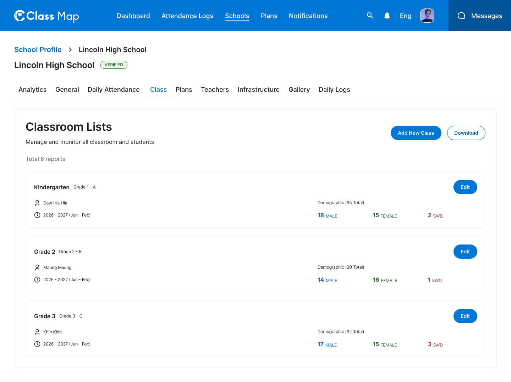
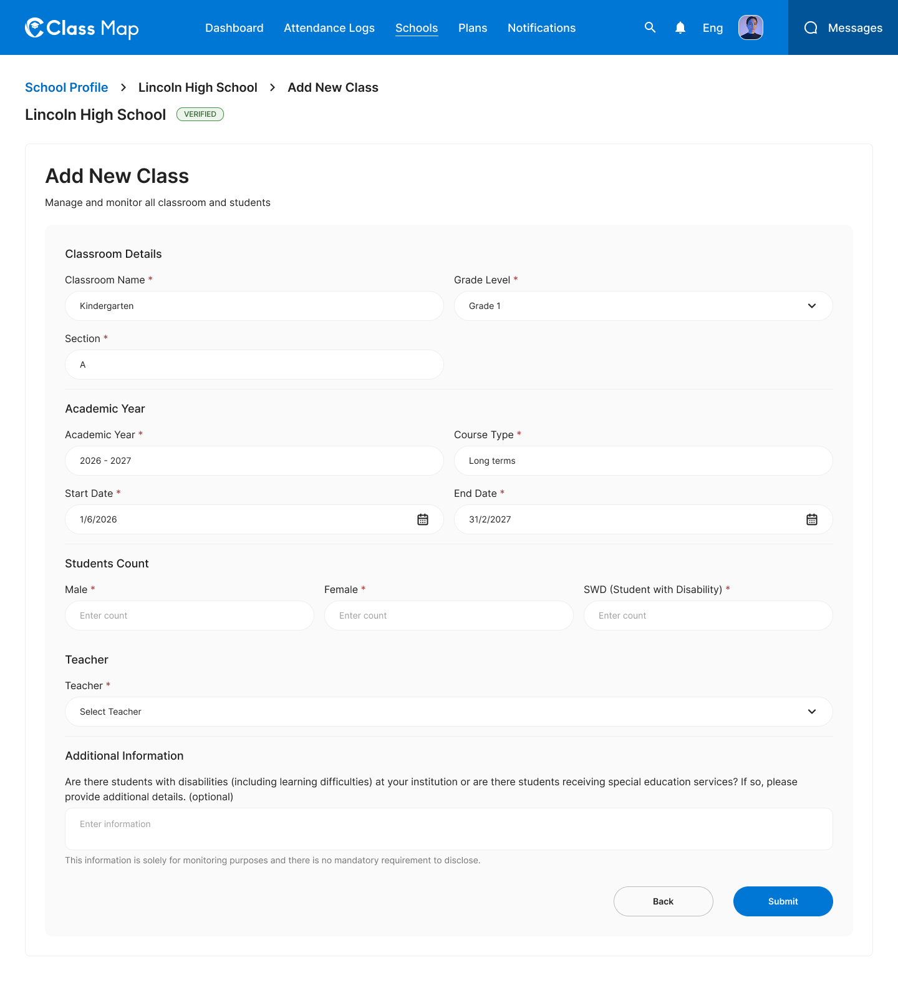
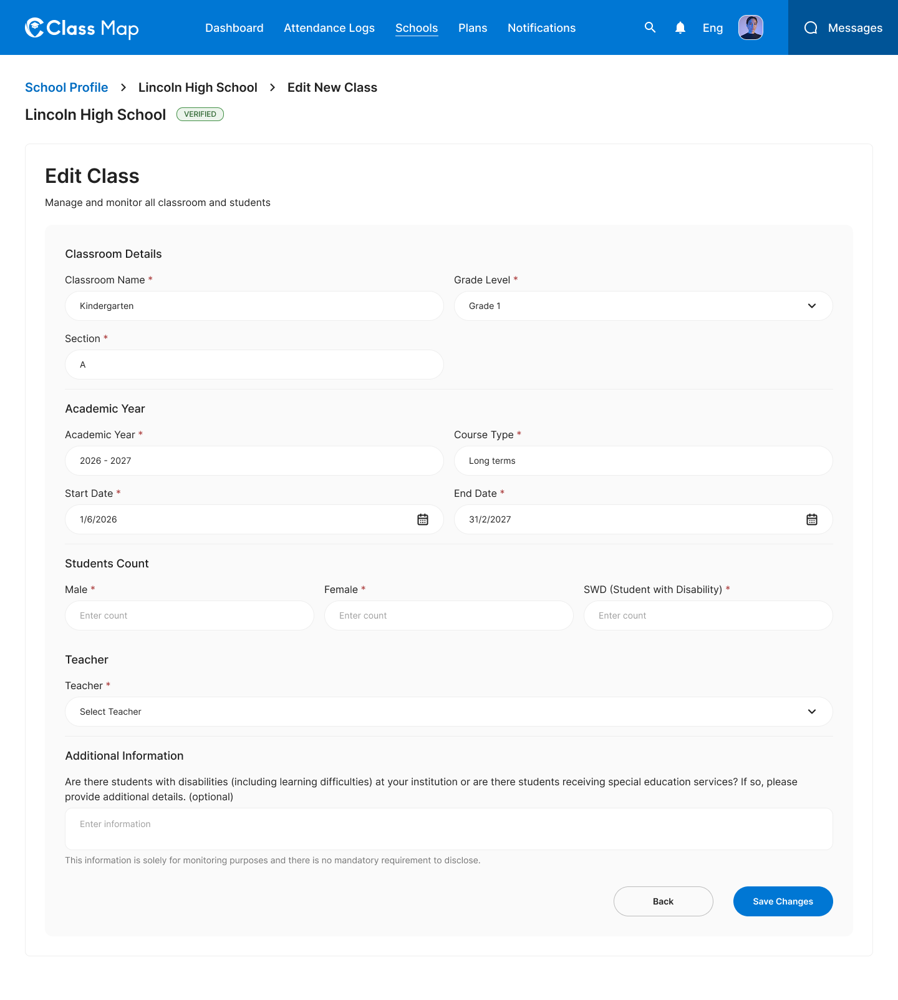

# Classroom Management – Schools





## Flow

```
Admin opens Class tab
        |
        v
GET /api/v1/schools/{id}/classes       <-- list all classrooms
        |
        +---> Admin clicks "Add New Class"
        |              |
        |              v
        |     POST /api/v1/schools/{id}/classes   (Submit)
        |
        +---> Admin clicks "Edit" on a class
                       |
                       v
             PUT /api/v1/schools/{id}/classes/{class_id}  (Save Changes)
        |
        +---> Admin clicks "Download"
                       |
                       v
             GET /api/v1/schools/{id}/classes/export
```

## Endpoints

- [GET `/api/v1/schools/{id}/classes`](#1-list-classrooms) — Paginated classroom list
- [POST `/api/v1/schools/{id}/classes`](#2-create-classroom) — Add a new classroom
- [PUT `/api/v1/schools/{id}/classes/{class_id}`](#3-update-classroom) — Full update of a classroom
- [GET `/api/v1/schools/{id}/classes/export`](#4-export-classrooms) — Download classrooms as CSV/Excel

---

### 1. List Classrooms
**GET** `/api/v1/schools/{id}/classes`

**Headers**

| Key | Value | Required |
|---|---|---|
| `Authorization` | `Bearer {{access_token}}` | Yes |
| `Content-Type` | `application/json` | Yes |
| `X-Request-ID` | `<uuid>` | Yes |

**Path Parameters**

| Parameter | Type | Required | Description |
|---|---|---|---|
| `id` | string | Yes | School UUID |

**Query Parameters**

| Parameter | Type | Required | Description |
|---|---|---|---|
| `page` | integer | No | Page number (default: 1) |
| `per_page` | integer | No | Items per page (default: 10) |

**Response – 200 OK**

```json
{
  "success": true,
  "data": [
    {
      "id": "cls_001",
      "classroom_name": "Kindergarten",
      "grade_level": "Grade 1",
      "section": "A",
      "teacher": {
        "id": "tch_001",
        "name": "Daw Hla Hla"
      },
      "academic_year": "2026 - 2027",
      "course_type": "Long terms",
      "start_date": "2026-06-01",
      "end_date": "2027-02-28",
      "student_count": {
        "total": 35,
        "male": 18,
        "female": 15,
        "swd": 2
      }
    }
  ],
  "meta": {
    "page": 1,
    "per_page": 10,
    "total": 8
  },
  "error": null,
  "message": "Successfully"
}
```

**Response – 4xx / 5xx**

| Status | Error Code | Description |
|---|---|---|
| `401` | `UNAUTHORIZED` | Missing or invalid token |
| `403` | `FORBIDDEN` | Insufficient role |
| `404` | `SCHOOL_NOT_FOUND` | School ID does not exist |
| `429` | `RATE_LIMIT_EXCEEDED` | Rate limit exceeded |
| `500` | `INTERNAL_SERVER_ERROR` | Unexpected server fault |

---

### 2. Create Classroom
**POST** `/api/v1/schools/{id}/classes`

**Headers**

| Key | Value | Required |
|---|---|---|
| `Authorization` | `Bearer {{access_token}}` | Yes |
| `Content-Type` | `application/json` | Yes |
| `X-Request-ID` | `<uuid>` | Yes |

**Path Parameters**

| Parameter | Type | Required | Description |
|---|---|---|---|
| `id` | string | Yes | School UUID |

**Request Body**

| Field | Type | Required | Description |
|---|---|---|---|
| `classroom_name` | string | Yes | Name of the classroom |
| `grade_level` | string | Yes | Grade level (e.g. `Grade 1`) |
| `section` | string | Yes | Section identifier (e.g. `A`) |
| `academic_year` | string | Yes | Academic year (e.g. `2026 - 2027`) |
| `course_type` | string | Yes | Course type (e.g. `Long terms`) |
| `start_date` | string | Yes | Course start date (ISO 8601: `YYYY-MM-DD`) |
| `end_date` | string | Yes | Course end date (ISO 8601: `YYYY-MM-DD`) |
| `male_count` | integer | Yes | Number of male students |
| `female_count` | integer | Yes | Number of female students |
| `swd_count` | integer | Yes | Number of students with disabilities |
| `teacher_id` | string | Yes | Teacher UUID |
| `additional_info` | string | No | Notes about students with special needs |

```json
{
  "classroom_name": "Kindergarten",
  "grade_level": "Grade 1",
  "section": "A",
  "academic_year": "2026 - 2027",
  "course_type": "Long terms",
  "start_date": "2026-06-01",
  "end_date": "2027-02-28",
  "male_count": 18,
  "female_count": 15,
  "swd_count": 2,
  "teacher_id": "tch_001",
  "additional_info": "Two students require additional reading support."
}
```

**Response – 201 Created**

```json
{
  "success": true,
  "data": {
    "id": "cls_009",
    "classroom_name": "Kindergarten",
    "grade_level": "Grade 1",
    "section": "A",
    "academic_year": "2026 - 2027",
    "course_type": "Long terms",
    "start_date": "2026-06-01",
    "end_date": "2027-02-28",
    "student_count": { "male": 18, "female": 15, "swd": 2, "total": 35 },
    "teacher": { "id": "tch_001", "name": "Daw Hla Hla" }
  },
  "meta": null,
  "error": null,
  "message": "Classroom created successfully"
}
```

**Response – 4xx / 5xx**

| Status | Error Code | Description |
|---|---|---|
| `400` | `VALIDATION_ERROR` | Missing required fields or invalid date |
| `401` | `UNAUTHORIZED` | Missing or invalid token |
| `403` | `FORBIDDEN` | Insufficient role |
| `404` | `SCHOOL_NOT_FOUND` | School ID does not exist |
| `409` | `CONFLICT` | Classroom section already exists for this grade |
| `422` | `BUSINESS_RULE_VIOLATION` | End date before start date |
| `429` | `RATE_LIMIT_EXCEEDED` | Rate limit exceeded |
| `500` | `INTERNAL_SERVER_ERROR` | Unexpected server fault |

---

### 3. Update Classroom
**PUT** `/api/v1/schools/{id}/classes/{class_id}`

**Headers**

| Key | Value | Required |
|---|---|---|
| `Authorization` | `Bearer {{access_token}}` | Yes |
| `Content-Type` | `application/json` | Yes |
| `X-Request-ID` | `<uuid>` | Yes |

**Path Parameters**

| Parameter | Type | Required | Description |
|---|---|---|---|
| `id` | string | Yes | School UUID |
| `class_id` | string | Yes | Classroom UUID |

**Request Body**

Same fields as [Create Classroom](#2-create-classroom). All fields required for a full replace.

```json
{
  "classroom_name": "Kindergarten",
  "grade_level": "Grade 1",
  "section": "A",
  "academic_year": "2026 - 2027",
  "course_type": "Long terms",
  "start_date": "2026-06-01",
  "end_date": "2027-02-28",
  "male_count": 20,
  "female_count": 15,
  "swd_count": 2,
  "teacher_id": "tch_001",
  "additional_info": ""
}
```

**Response – 200 OK**

```json
{
  "success": true,
  "data": {
    "id": "cls_001",
    "classroom_name": "Kindergarten",
    "grade_level": "Grade 1",
    "section": "A",
    "student_count": { "male": 20, "female": 15, "swd": 2, "total": 37 }
  },
  "meta": null,
  "error": null,
  "message": "Classroom updated successfully"
}
```

**Response – 4xx / 5xx**

| Status | Error Code | Description |
|---|---|---|
| `400` | `VALIDATION_ERROR` | Invalid input |
| `401` | `UNAUTHORIZED` | Missing or invalid token |
| `403` | `FORBIDDEN` | Insufficient role |
| `404` | `CLASSROOM_NOT_FOUND` | Classroom ID does not exist |
| `409` | `CONFLICT` | Concurrent update conflict |
| `422` | `BUSINESS_RULE_VIOLATION` | End date before start date |
| `429` | `RATE_LIMIT_EXCEEDED` | Rate limit exceeded |
| `500` | `INTERNAL_SERVER_ERROR` | Unexpected server fault |

---

### 4. Export Classrooms
**GET** `/api/v1/schools/{id}/classes/export`

**Headers**

| Key | Value | Required |
|---|---|---|
| `Authorization` | `Bearer {{access_token}}` | Yes |
| `X-Request-ID` | `<uuid>` | Yes |

**Path Parameters**

| Parameter | Type | Required | Description |
|---|---|---|---|
| `id` | string | Yes | School UUID |

**Response – 200 OK**

Returns a binary file download (`Content-Type: application/vnd.openxmlformats-officedocument.spreadsheetml.sheet`).

**Response – 4xx / 5xx**

| Status | Error Code | Description |
|---|---|---|
| `401` | `UNAUTHORIZED` | Missing or invalid token |
| `403` | `FORBIDDEN` | Insufficient role |
| `404` | `SCHOOL_NOT_FOUND` | School ID does not exist |
| `500` | `INTERNAL_SERVER_ERROR` | Unexpected server fault |

## Error Codes

| Code | HTTP Status | Description |
|---|---|---|
| `VALIDATION_ERROR` | 400 | Invalid input |
| `UNAUTHORIZED` | 401 | Missing or invalid token |
| `FORBIDDEN` | 403 | Insufficient role |
| `SCHOOL_NOT_FOUND` | 404 | School not found |
| `CLASSROOM_NOT_FOUND` | 404 | Classroom not found |
| `CONFLICT` | 409 | Duplicate section or concurrent update |
| `BUSINESS_RULE_VIOLATION` | 422 | Date range invalid |
| `RATE_LIMIT_EXCEEDED` | 429 | Too many requests |
| `INTERNAL_SERVER_ERROR` | 500 | Unexpected server error |
