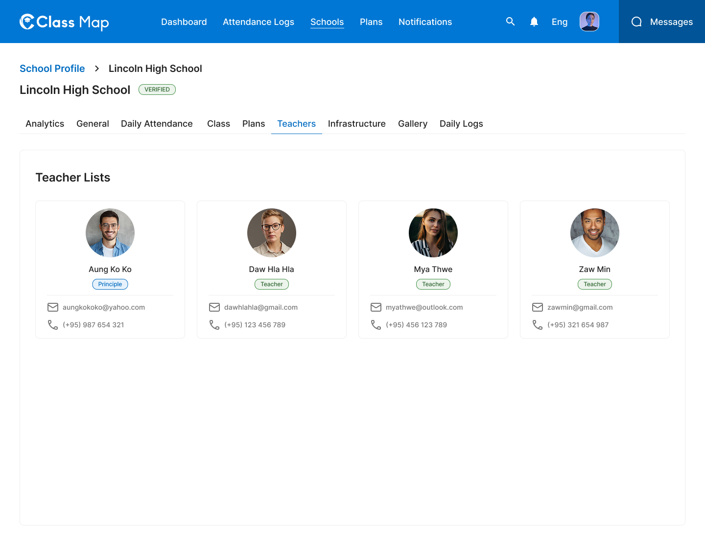
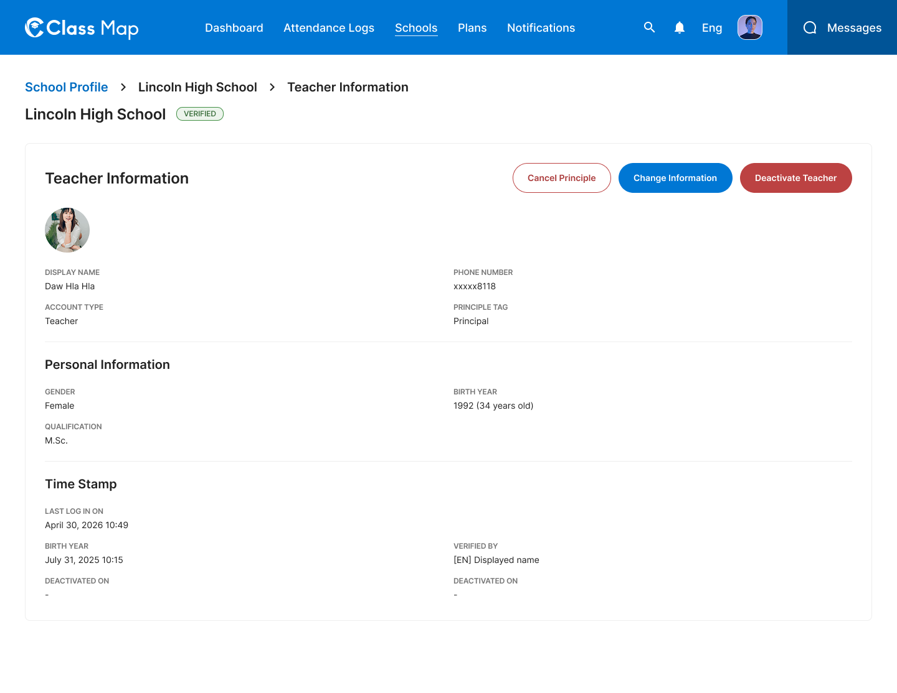

# Teacher Management – Schools





## Flow

```
Admin opens Teachers tab
        |
        v
GET /api/v1/schools/{id}/teachers          <-- card list of teachers

Admin clicks a teacher card
        |
        v
GET /api/v1/schools/{id}/teachers/{teacher_id}   <-- teacher detail

        +---> "Change Information" button
        |              |
        |              v
        |     PATCH /api/v1/schools/{id}/teachers/{teacher_id}  (Save)
        |
        +---> "Deactivate Teacher" button
        |              |
        |              v
        |     PATCH /api/v1/schools/{id}/teachers/{teacher_id}/deactivate
        |
        +---> "Cancel Principle" button
                       |
                       v
             PATCH /api/v1/schools/{id}/teachers/{teacher_id}/principle
             { "is_principal": false }
```

## Endpoints

- [GET `/api/v1/schools/{id}/teachers`](#1-list-teachers) — Teacher card list for a school
- [GET `/api/v1/schools/{id}/teachers/{teacher_id}`](#2-get-teacher-detail) — Full teacher profile
- [PATCH `/api/v1/schools/{id}/teachers/{teacher_id}`](#3-update-teacher) — Update teacher information
- [PATCH `/api/v1/schools/{id}/teachers/{teacher_id}/deactivate`](#4-deactivate-teacher) — Deactivate a teacher account
- [PATCH `/api/v1/schools/{id}/teachers/{teacher_id}/principle`](#5-toggle-principal-status) — Set or unset principal role
- [DELETE `/api/v1/schools/{id}/teachers/{teacher_id}`](#6-delete-teacher) — Permanently remove a teacher

---

### 1. List Teachers
**GET** `/api/v1/schools/{id}/teachers`

**Headers**

| Key | Value | Required |
|---|---|---|
| `Authorization` | `Bearer {{access_token}}` | Yes |
| `Content-Type` | `application/json` | Yes |
| `X-Request-ID` | `<uuid>` | Yes |

**Path Parameters**

| Parameter | Type | Required | Description |
|---|---|---|---|
| `id` | string | Yes | School UUID |

**Response – 200 OK**

```json
{
  "success": true,
  "data": [
    {
      "id": "tch_001",
      "display_name": "Aung Ko Ko",
      "role": "principal",
      "email": "aungkokoko@yahoo.com",
      "phone": "(+95) 987 654 321",
      "photo_url": "https://storage.example.com/teachers/tch_001.jpg"
    },
    {
      "id": "tch_002",
      "display_name": "Daw Hla Hla",
      "role": "teacher",
      "email": "dawhlahla@gmail.com",
      "phone": "(+95) 123 456 789",
      "photo_url": "https://storage.example.com/teachers/tch_002.jpg"
    },
    {
      "id": "tch_003",
      "display_name": "Mya Thwe",
      "role": "teacher",
      "email": "myathwe@outlook.com",
      "phone": "(+95) 456 123 789",
      "photo_url": "https://storage.example.com/teachers/tch_003.jpg"
    },
    {
      "id": "tch_004",
      "display_name": "Zaw Min",
      "role": "teacher",
      "email": "zawmin@gmail.com",
      "phone": "(+95) 321 654 987",
      "photo_url": "https://storage.example.com/teachers/tch_004.jpg"
    }
  ],
  "meta": null,
  "error": null,
  "message": "Successfully"
}
```

**Response – 4xx / 5xx**

| Status | Error Code | Description |
|---|---|---|
| `401` | `UNAUTHORIZED` | Missing or invalid token |
| `403` | `FORBIDDEN` | Insufficient role |
| `404` | `SCHOOL_NOT_FOUND` | School ID does not exist |
| `429` | `RATE_LIMIT_EXCEEDED` | Rate limit exceeded |
| `500` | `INTERNAL_SERVER_ERROR` | Unexpected server fault |

---

### 2. Get Teacher Detail
**GET** `/api/v1/schools/{id}/teachers/{teacher_id}`

**Headers**

| Key | Value | Required |
|---|---|---|
| `Authorization` | `Bearer {{access_token}}` | Yes |
| `Content-Type` | `application/json` | Yes |
| `X-Request-ID` | `<uuid>` | Yes |

**Path Parameters**

| Parameter | Type | Required | Description |
|---|---|---|---|
| `id` | string | Yes | School UUID |
| `teacher_id` | string | Yes | Teacher UUID |

**Response – 200 OK**

```json
{
  "success": true,
  "data": {
    "id": "tch_002",
    "display_name": "Daw Hla Hla",
    "phone_number": "xxxxx8118",
    "account_type": "Teacher",
    "principle_tag": "Principal",
    "photo_url": "https://storage.example.com/teachers/tch_002.jpg",
    "personal_information": {
      "gender": "Female",
      "birth_year": 1992,
      "age": 34,
      "qualification": "M.Sc."
    },
    "timestamps": {
      "last_login_on": "2026-04-30T10:49:00Z",
      "created_at": "2025-07-31T10:15:00Z",
      "verified_by": "Displayed name",
      "deactivated_on": null
    }
  },
  "meta": null,
  "error": null,
  "message": "Successfully"
}
```

**Response – 4xx / 5xx**

| Status | Error Code | Description |
|---|---|---|
| `401` | `UNAUTHORIZED` | Missing or invalid token |
| `403` | `FORBIDDEN` | Insufficient role |
| `404` | `TEACHER_NOT_FOUND` | Teacher ID does not exist |
| `429` | `RATE_LIMIT_EXCEEDED` | Rate limit exceeded |
| `500` | `INTERNAL_SERVER_ERROR` | Unexpected server fault |

---

### 3. Update Teacher
**PATCH** `/api/v1/schools/{id}/teachers/{teacher_id}`

**Headers**

| Key | Value | Required |
|---|---|---|
| `Authorization` | `Bearer {{access_token}}` | Yes |
| `Content-Type` | `application/json` | Yes |
| `X-Request-ID` | `<uuid>` | Yes |

**Path Parameters**

| Parameter | Type | Required | Description |
|---|---|---|---|
| `id` | string | Yes | School UUID |
| `teacher_id` | string | Yes | Teacher UUID |

**Request Body**

| Field | Type | Required | Description |
|---|---|---|---|
| `title` | string | Yes | Teacher title (e.g. `U`, `Daw`, `Ko`) |
| `name` | string | No | Full name |
| `user_id` | string | No | Linked user account UUID |
| `school_id` | string | No | Associated school UUID |
| `specific` | string | No | Specialization notes |
| `memo_to_unesco` | string | No | Memo for UNESCO reporting |
| `email` | string | No | Email address |
| `phone_number` | string | No | Phone number |
| `qualifications` | string | No | Academic qualifications |
| `birth_year` | integer | No | Year of birth |
| `gender` | string | No | Gender: `male`, `female`, `other` |
| `is_principal` | boolean | No | Whether teacher is principal |
| `hash_pin` | string | No | Hashed PIN for biometric login |
| `biometric_public_key` | string | No | Biometric authentication key |
| `approved_by` | string | No | UUID of approving admin |
| `deactivated_by` | string | No | UUID of deactivating admin |
| `deactivation_date` | string | No | Planned deactivation datetime (ISO 8601) |
| `publish_account` | boolean | No | Publish teacher to public directory |

```json
{
  "title": "Daw",
  "name": "Hla Hla",
  "email": "dawhlahla@gmail.com",
  "phone_number": "(+95) 123 456 789",
  "qualifications": "M.Sc.",
  "birth_year": 1992,
  "gender": "female",
  "is_principal": true,
  "publish_account": true
}
```

**Response – 200 OK**

```json
{
  "success": true,
  "data": {
    "id": "tch_002",
    "display_name": "Daw Hla Hla",
    "updated_at": "2026-05-08T10:00:00Z"
  },
  "meta": null,
  "error": null,
  "message": "Teacher information saved successfully"
}
```

**Response – 4xx / 5xx**

| Status | Error Code | Description |
|---|---|---|
| `400` | `VALIDATION_ERROR` | Invalid or missing required fields |
| `401` | `UNAUTHORIZED` | Missing or invalid token |
| `403` | `FORBIDDEN` | Insufficient role |
| `404` | `TEACHER_NOT_FOUND` | Teacher ID does not exist |
| `409` | `CONFLICT` | Concurrent update conflict |
| `422` | `BUSINESS_RULE_VIOLATION` | Business rule violation |
| `429` | `RATE_LIMIT_EXCEEDED` | Rate limit exceeded |
| `500` | `INTERNAL_SERVER_ERROR` | Unexpected server fault |

---

### 4. Deactivate Teacher
**PATCH** `/api/v1/schools/{id}/teachers/{teacher_id}/deactivate`

**Headers**

| Key | Value | Required |
|---|---|---|
| `Authorization` | `Bearer {{access_token}}` | Yes |
| `Content-Type` | `application/json` | Yes |
| `X-Request-ID` | `<uuid>` | Yes |

**Path Parameters**

| Parameter | Type | Required | Description |
|---|---|---|---|
| `id` | string | Yes | School UUID |
| `teacher_id` | string | Yes | Teacher UUID |

**Request Body**

| Field | Type | Required | Description |
|---|---|---|---|
| `reason` | string | No | Reason for deactivation |

```json
{
  "reason": "Teacher resigned."
}
```

**Response – 200 OK**

```json
{
  "success": true,
  "data": {
    "id": "tch_002",
    "status": "deactivated",
    "deactivated_on": "2026-05-08T10:00:00Z"
  },
  "meta": null,
  "error": null,
  "message": "Teacher account deactivated successfully"
}
```

**Response – 4xx / 5xx**

| Status | Error Code | Description |
|---|---|---|
| `401` | `UNAUTHORIZED` | Missing or invalid token |
| `403` | `FORBIDDEN` | Insufficient role |
| `404` | `TEACHER_NOT_FOUND` | Teacher ID does not exist |
| `422` | `BUSINESS_RULE_VIOLATION` | Teacher already deactivated |
| `429` | `RATE_LIMIT_EXCEEDED` | Rate limit exceeded |
| `500` | `INTERNAL_SERVER_ERROR` | Unexpected server fault |

---

### 5. Toggle Principal Status
**PATCH** `/api/v1/schools/{id}/teachers/{teacher_id}/principle`

**Headers**

| Key | Value | Required |
|---|---|---|
| `Authorization` | `Bearer {{access_token}}` | Yes |
| `Content-Type` | `application/json` | Yes |
| `X-Request-ID` | `<uuid>` | Yes |

**Path Parameters**

| Parameter | Type | Required | Description |
|---|---|---|---|
| `id` | string | Yes | School UUID |
| `teacher_id` | string | Yes | Teacher UUID |

**Request Body**

| Field | Type | Required | Description |
|---|---|---|---|
| `is_principal` | boolean | Yes | `true` to assign, `false` to remove principal role |

```json
{
  "is_principal": false
}
```

**Response – 200 OK**

```json
{
  "success": true,
  "data": {
    "id": "tch_002",
    "is_principal": false,
    "updated_at": "2026-05-08T10:00:00Z"
  },
  "meta": null,
  "error": null,
  "message": "Principal status updated successfully"
}
```

**Response – 4xx / 5xx**

| Status | Error Code | Description |
|---|---|---|
| `400` | `VALIDATION_ERROR` | Missing `is_principal` field |
| `401` | `UNAUTHORIZED` | Missing or invalid token |
| `403` | `FORBIDDEN` | Insufficient role |
| `404` | `TEACHER_NOT_FOUND` | Teacher ID does not exist |
| `422` | `BUSINESS_RULE_VIOLATION` | Cannot remove sole principal without assigning another |
| `429` | `RATE_LIMIT_EXCEEDED` | Rate limit exceeded |
| `500` | `INTERNAL_SERVER_ERROR` | Unexpected server fault |

---

### 6. Delete Teacher
**DELETE** `/api/v1/schools/{id}/teachers/{teacher_id}`

**Headers**

| Key | Value | Required |
|---|---|---|
| `Authorization` | `Bearer {{access_token}}` | Yes |
| `X-Request-ID` | `<uuid>` | Yes |

**Path Parameters**

| Parameter | Type | Required | Description |
|---|---|---|---|
| `id` | string | Yes | School UUID |
| `teacher_id` | string | Yes | Teacher UUID |

**Response – 204 No Content**

No body returned.

**Response – 4xx / 5xx**

| Status | Error Code | Description |
|---|---|---|
| `401` | `UNAUTHORIZED` | Missing or invalid token |
| `403` | `FORBIDDEN` | Insufficient role |
| `404` | `TEACHER_NOT_FOUND` | Teacher ID does not exist |
| `422` | `BUSINESS_RULE_VIOLATION` | Cannot delete active principal |
| `429` | `RATE_LIMIT_EXCEEDED` | Rate limit exceeded |
| `500` | `INTERNAL_SERVER_ERROR` | Unexpected server fault |

## Error Codes

| Code | HTTP Status | Description |
|---|---|---|
| `VALIDATION_ERROR` | 400 | Invalid or missing fields |
| `UNAUTHORIZED` | 401 | Missing or invalid token |
| `FORBIDDEN` | 403 | Insufficient role |
| `SCHOOL_NOT_FOUND` | 404 | School not found |
| `TEACHER_NOT_FOUND` | 404 | Teacher not found |
| `CONFLICT` | 409 | Concurrent update conflict |
| `BUSINESS_RULE_VIOLATION` | 422 | Business rule failed |
| `RATE_LIMIT_EXCEEDED` | 429 | Too many requests |
| `INTERNAL_SERVER_ERROR` | 500 | Unexpected server error |
