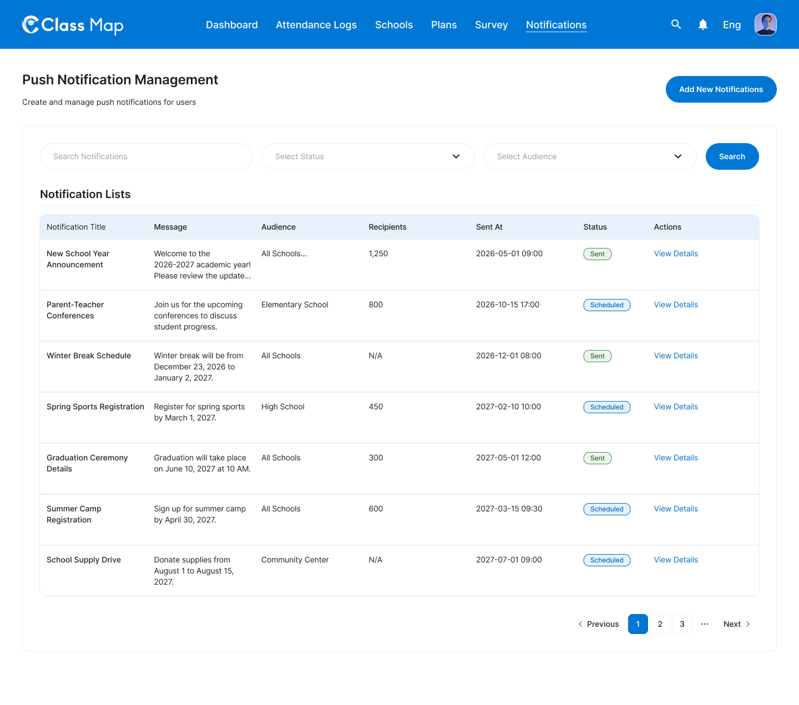
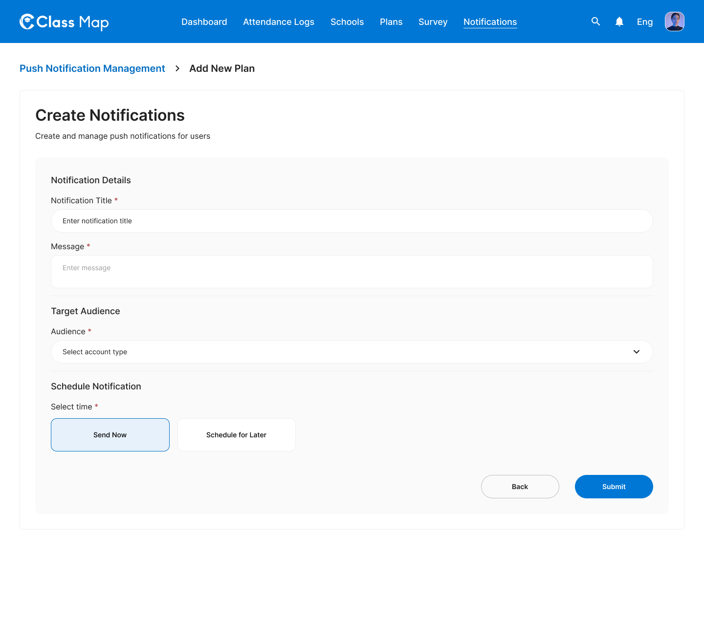
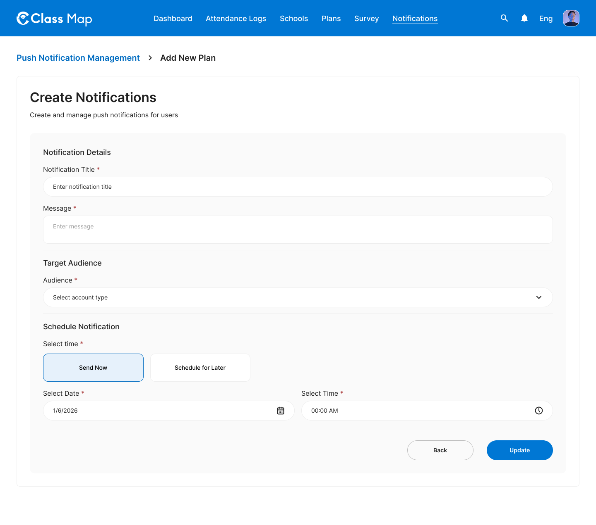
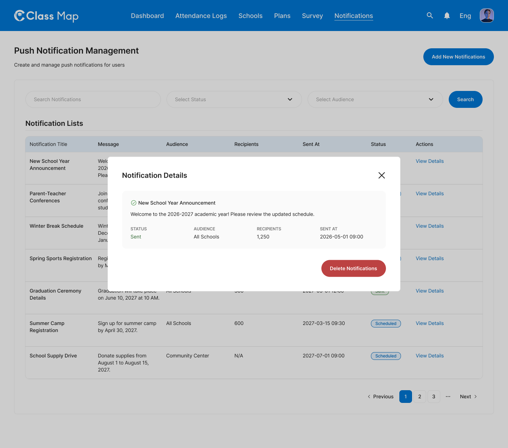
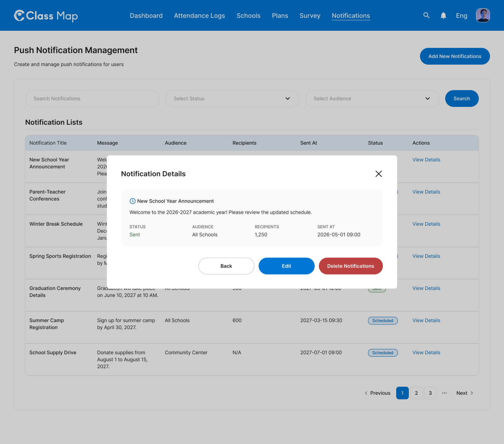
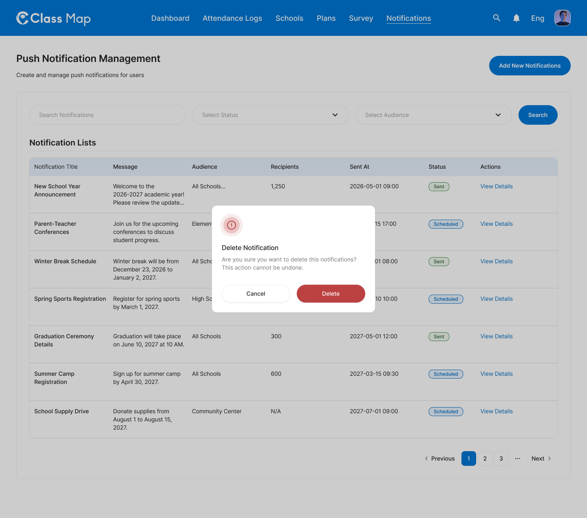

# Push Notifications – Notifications








## Flow

```
Admin navigates to Notifications
        |
        v
GET /api/v1/admin/notifications                 <-- list (search + status + audience filters + pagination)
        |
        +---> Admin clicks "Add New Notifications"
        |       GET /api/v1/admin/notifications/audiences   <-- populate Audience dropdown
        |       Fill: title, message, audience, schedule (Send Now | Schedule for Later + date/time)
        |              |
        |              v (Submit)
        |       POST /api/v1/admin/notifications
        |
        +---> Admin clicks "View Details"
        |              |
        |              v
        |       GET /api/v1/admin/notifications/{id}
        |              |
        |              +---> Status = Scheduled
        |              |         +---> "Edit"  -> PUT /api/v1/admin/notifications/{id}
        |              |         +---> "Delete Notifications" -> confirm -> DELETE /api/v1/admin/notifications/{id}
        |              |
        |              +---> Status = Sent
        |                        +---> "Delete Notifications" -> confirm -> DELETE /api/v1/admin/notifications/{id}
```

## Endpoints

- [GET `/api/v1/admin/notifications`](#1-list-notifications) — Paginated notification list with filters
- [GET `/api/v1/admin/notifications/audiences`](#2-list-audiences) — Audience options for the dropdown
- [POST `/api/v1/admin/notifications`](#3-create-notification) — Create and send or schedule a notification
- [GET `/api/v1/admin/notifications/{id}`](#4-get-notification-detail) — Get full notification detail
- [PUT `/api/v1/admin/notifications/{id}`](#5-update-notification) — Update a scheduled notification (not allowed after sending)
- [DELETE `/api/v1/admin/notifications/{id}`](#6-delete-notification) — Delete a notification (sent or scheduled)

---

### 1. List Notifications
**GET** `/api/v1/admin/notifications`

**Headers**

| Key | Value | Required |
|---|---|---|
| `Authorization` | `Bearer {{access_token}}` | Yes |
| `Content-Type` | `application/json` | Yes |
| `X-Request-ID` | `<uuid>` | Yes |

**Query Parameters**

| Parameter | Type | Required | Description |
|---|---|---|---|
| `page` | integer | No | Page number (default: 1) |
| `per_page` | integer | No | Items per page (default: 20) |
| `search` | string | No | Search by notification title or message |
| `status` | string | No | Filter: `sent`, `scheduled`, `draft`, `failed` |
| `audience` | string | No | Filter by audience code (see `/audiences`) |

**Response – 200 OK**

```json
{
  "success": true,
  "data": [
    {
      "id": "ntf_001",
      "title": "New School Year Announcement",
      "message": "Welcome to the 2026-2027 academic year! Please review the updated schedule.",
      "audience": {
        "code": "ALL_SCHOOLS",
        "label": "All Schools"
      },
      "recipients": 1250,
      "sent_at": "2026-05-01T09:00:00Z",
      "status": "sent",
      "created_at": "2026-04-28T10:12:00Z"
    },
    {
      "id": "ntf_002",
      "title": "Parent-Teacher Conferences",
      "message": "Join us for the upcoming conferences to discuss student progress.",
      "audience": {
        "code": "ELEMENTARY_SCHOOL",
        "label": "Elementary School"
      },
      "recipients": 800,
      "sent_at": "2026-10-15T17:00:00Z",
      "status": "scheduled",
      "created_at": "2026-09-20T14:00:00Z"
    }
  ],
  "meta": {
    "page": 1,
    "per_page": 20,
    "total": 34
  },
  "error": null,
  "message": "Successfully"
}
```

**Response – 4xx / 5xx**

| Status | Error Code | Description |
|---|---|---|
| `400` | `VALIDATION_ERROR` | Invalid query parameter |
| `401` | `UNAUTHORIZED` | Missing or invalid token |
| `403` | `FORBIDDEN` | Insufficient role |
| `429` | `RATE_LIMIT_EXCEEDED` | Rate limit exceeded |
| `500` | `INTERNAL_SERVER_ERROR` | Unexpected server fault |

---

### 2. List Audiences
**GET** `/api/v1/admin/notifications/audiences`

Used by the Create/Edit form to populate the "Audience" dropdown (`Select account type`).

**Headers**

| Key | Value | Required |
|---|---|---|
| `Authorization` | `Bearer {{access_token}}` | Yes |
| `X-Request-ID` | `<uuid>` | Yes |

**Response – 200 OK**

```json
{
  "success": true,
  "data": [
    { "code": "ALL_SCHOOLS",       "label": "All Schools",       "estimated_recipients": 1250 },
    { "code": "ELEMENTARY_SCHOOL", "label": "Elementary School", "estimated_recipients": 800  },
    { "code": "HIGH_SCHOOL",       "label": "High School",       "estimated_recipients": 450  },
    { "code": "COMMUNITY_CENTER",  "label": "Community Center",  "estimated_recipients": 0    }
  ],
  "meta": null,
  "error": null,
  "message": "Successfully"
}
```

**Response – 4xx / 5xx**

| Status | Error Code | Description |
|---|---|---|
| `401` | `UNAUTHORIZED` | Missing or invalid token |
| `403` | `FORBIDDEN` | Insufficient role |
| `500` | `INTERNAL_SERVER_ERROR` | Unexpected server fault |

---

### 3. Create Notification
**POST** `/api/v1/admin/notifications`

**Headers**

| Key | Value | Required |
|---|---|---|
| `Authorization` | `Bearer {{access_token}}` | Yes |
| `Content-Type` | `application/json` | Yes |
| `X-Request-ID` | `<uuid>` | Yes |

**Request Body**

| Field | Type | Required | Description |
|---|---|---|---|
| `title` | string | Yes | Notification title (max 120 chars) |
| `message` | string | Yes | Notification body (max 500 chars) |
| `audience` | string | Yes | Audience code from `/audiences` endpoint |
| `schedule_type` | string | Yes | `send_now` or `schedule` |
| `scheduled_at` | string (ISO 8601) | Conditional | Required when `schedule_type = schedule`. Future datetime. |

**Example – Send Now**
```json
{
  "title": "Winter Break Schedule",
  "message": "Winter break will be from December 23, 2026 to January 2, 2027.",
  "audience": "ALL_SCHOOLS",
  "schedule_type": "send_now"
}
```

**Example – Schedule for Later**
```json
{
  "title": "Spring Sports Registration",
  "message": "Register for spring sports by March 1, 2027.",
  "audience": "HIGH_SCHOOL",
  "schedule_type": "schedule",
  "scheduled_at": "2027-02-10T10:00:00Z"
}
```

**Response – 201 Created**

```json
{
  "success": true,
  "data": {
    "id": "ntf_010",
    "title": "Spring Sports Registration",
    "message": "Register for spring sports by March 1, 2027.",
    "audience": {
      "code": "HIGH_SCHOOL",
      "label": "High School"
    },
    "recipients": 450,
    "status": "scheduled",
    "scheduled_at": "2027-02-10T10:00:00Z",
    "sent_at": null,
    "created_at": "2026-05-10T09:00:00Z"
  },
  "meta": null,
  "error": null,
  "message": "Notification created successfully"
}
```

**Response – 4xx / 5xx**

| Status | Error Code | Description |
|---|---|---|
| `400` | `VALIDATION_ERROR` | Missing required fields or invalid values |
| `401` | `UNAUTHORIZED` | Missing or invalid token |
| `403` | `FORBIDDEN` | Insufficient role |
| `404` | `AUDIENCE_NOT_FOUND` | Audience code does not exist |
| `422` | `BUSINESS_RULE_VIOLATION` | `scheduled_at` must be in the future |
| `429` | `RATE_LIMIT_EXCEEDED` | Rate limit exceeded |
| `500` | `INTERNAL_SERVER_ERROR` | Unexpected server fault |

---

### 4. Get Notification Detail
**GET** `/api/v1/admin/notifications/{id}`

Used by the "View Details" modal.

**Headers**

| Key | Value | Required |
|---|---|---|
| `Authorization` | `Bearer {{access_token}}` | Yes |
| `X-Request-ID` | `<uuid>` | Yes |

**Path Parameters**

| Parameter | Type | Required | Description |
|---|---|---|---|
| `id` | string | Yes | Notification UUID |

**Response – 200 OK**

```json
{
  "success": true,
  "data": {
    "id": "ntf_001",
    "title": "New School Year Announcement",
    "message": "Welcome to the 2026-2027 academic year! Please review the updated schedule.",
    "audience": {
      "code": "ALL_SCHOOLS",
      "label": "All Schools"
    },
    "recipients": 1250,
    "status": "sent",
    "schedule_type": "send_now",
    "scheduled_at": null,
    "sent_at": "2026-05-01T09:00:00Z",
    "created_at": "2026-04-28T10:12:00Z",
    "created_by": {
      "id": "usr_001",
      "display_name": "Taylor"
    },
    "can_edit": false,
    "can_delete": true
  },
  "meta": null,
  "error": null,
  "message": "Successfully"
}
```

**Response – 4xx / 5xx**

| Status | Error Code | Description |
|---|---|---|
| `401` | `UNAUTHORIZED` | Missing or invalid token |
| `403` | `FORBIDDEN` | Insufficient role |
| `404` | `NOTIFICATION_NOT_FOUND` | Notification ID does not exist |
| `429` | `RATE_LIMIT_EXCEEDED` | Rate limit exceeded |
| `500` | `INTERNAL_SERVER_ERROR` | Unexpected server fault |

---

### 5. Update Notification
**PUT** `/api/v1/admin/notifications/{id}`

Only allowed for notifications with `status = scheduled`. Returns `422` if the notification has already been sent.

**Headers**

| Key | Value | Required |
|---|---|---|
| `Authorization` | `Bearer {{access_token}}` | Yes |
| `Content-Type` | `application/json` | Yes |
| `X-Request-ID` | `<uuid>` | Yes |

**Path Parameters**

| Parameter | Type | Required | Description |
|---|---|---|---|
| `id` | string | Yes | Notification UUID |

**Request Body**

Same fields as [Create Notification](#3-create-notification). All required fields must be present.

```json
{
  "title": "Spring Sports Registration (Updated)",
  "message": "Register for spring sports by March 5, 2027.",
  "audience": "HIGH_SCHOOL",
  "schedule_type": "schedule",
  "scheduled_at": "2027-02-12T10:00:00Z"
}
```

**Response – 200 OK**

```json
{
  "success": true,
  "data": {
    "id": "ntf_010",
    "title": "Spring Sports Registration (Updated)",
    "status": "scheduled",
    "scheduled_at": "2027-02-12T10:00:00Z",
    "updated_at": "2026-05-10T09:30:00Z"
  },
  "meta": null,
  "error": null,
  "message": "Notification updated successfully"
}
```

**Response – 4xx / 5xx**

| Status | Error Code | Description |
|---|---|---|
| `400` | `VALIDATION_ERROR` | Invalid input |
| `401` | `UNAUTHORIZED` | Missing or invalid token |
| `403` | `FORBIDDEN` | Insufficient role |
| `404` | `NOTIFICATION_NOT_FOUND` | Notification not found |
| `409` | `CONFLICT` | Concurrent update conflict |
| `422` | `BUSINESS_RULE_VIOLATION` | Notification already sent or `scheduled_at` in the past |
| `429` | `RATE_LIMIT_EXCEEDED` | Rate limit exceeded |
| `500` | `INTERNAL_SERVER_ERROR` | Unexpected server fault |

---

### 6. Delete Notification
**DELETE** `/api/v1/admin/notifications/{id}`

Triggered from the "Delete Notifications" button on the detail modal (after the confirmation prompt). Allowed for both `sent` and `scheduled` notifications — scheduled deletions cancel the pending dispatch.

**Headers**

| Key | Value | Required |
|---|---|---|
| `Authorization` | `Bearer {{access_token}}` | Yes |
| `X-Request-ID` | `<uuid>` | Yes |

**Path Parameters**

| Parameter | Type | Required | Description |
|---|---|---|---|
| `id` | string | Yes | Notification UUID |

**Response – 204 No Content**

No body returned.

**Response – 4xx / 5xx**

| Status | Error Code | Description |
|---|---|---|
| `401` | `UNAUTHORIZED` | Missing or invalid token |
| `403` | `FORBIDDEN` | Insufficient role |
| `404` | `NOTIFICATION_NOT_FOUND` | Notification not found |
| `429` | `RATE_LIMIT_EXCEEDED` | Rate limit exceeded |
| `500` | `INTERNAL_SERVER_ERROR` | Unexpected server fault |

## Error Codes

| Code | HTTP Status | Description |
|---|---|---|
| `VALIDATION_ERROR` | 400 | Invalid or missing fields |
| `UNAUTHORIZED` | 401 | Missing or invalid token |
| `FORBIDDEN` | 403 | Insufficient role |
| `NOTIFICATION_NOT_FOUND` | 404 | Notification not found |
| `AUDIENCE_NOT_FOUND` | 404 | Audience code not found |
| `CONFLICT` | 409 | Concurrent update conflict |
| `BUSINESS_RULE_VIOLATION` | 422 | Scheduled time in the past, or editing a sent notification |
| `RATE_LIMIT_EXCEEDED` | 429 | Too many requests |
| `INTERNAL_SERVER_ERROR` | 500 | Unexpected server error |
