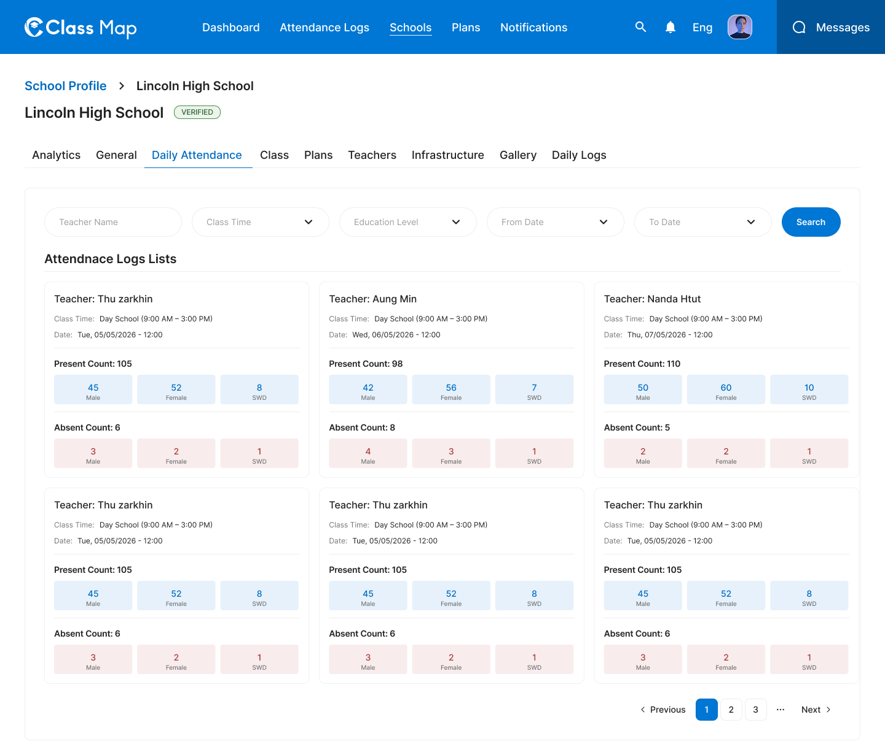

# Daily Attendance – Schools



## Flow

```
Admin opens Daily Attendance tab
        |
        v
GET /api/v1/admin/schools/{id}/attendance   <-- default list (no filters)
        |
Admin applies filters (teacher name, class time, education level, date range)
        |
        v
GET /api/v1/admin/schools/{id}/attendance?teacher_name=...&from_date=...  <-- filtered
```

## Endpoints

- [GET `/api/v1/admin/schools/{id}/attendance`](#1-list-school-daily-attendance) — Paginated attendance logs with optional filters

---

### 1. List School Daily Attendance

**GET** `/api/v1/admin/schools/{id}/attendance`

**Headers**

| Key             | Value                     | Required |
| --------------- | ------------------------- | -------- |
| `Authorization` | `Bearer {{access_token}}` | Yes      |
| `Content-Type`  | `application/json`        | Yes      |
| `X-Request-ID`  | `<uuid>`                  | Yes      |

**Path Parameters**

| Parameter | Type   | Required | Description |
| --------- | ------ | -------- | ----------- |
| `id`      | string | Yes      | School UUID |

**Query Parameters**

| Parameter        | Type    | Required | Description                                            |
| ---------------- | ------- | -------- | ------------------------------------------------------ |
| `teacherName`    | string  | No       | Filter by teacher name (partial match)                 |
| `classTime`      | string  | No       | Filter by class time slot: `day`, `evening`, `morning` |
| `educationLevel` | string  | No       | Filter by education level                              |
| `fromDate`       | string  | No       | Start date (ISO 8601: `YYYY-MM-DD`)                    |
| `toDate`         | string  | No       | End date (ISO 8601: `YYYY-MM-DD`)                      |
| `page`           | integer | No       | Page number (default: 1)                               |
| `limit`       | integer | No       | Items per page (default: 10)                           |

**Response – 200 OK**

```json
{
  "success": true,
  "data": [
    {
      "id": "att_001",
      "date": "2026-05-05",
      "teacherName": "Thu Zarkhin",
      "classTime": "Day School (9:00 AM - 3:00 PM)",
      "customClassStartTime": null,
      "customClassEndTime": null,
      "isReviewed": true,
      "note": "Normal attendance day",
      "maleCount": 45,
      "femaleCount": 52,
      "swdCount": 8,
      "schoolMaleCount": 48,
      "schoolFemaleCount": 55,
      "schoolSwdCount": 9
    },
    {
      "id": "att_002",
      "date": "2026-06-05",
      "teacherName": "Aung Min",
      "classTime": "Day School (9:00 AM - 3:00 PM)",
      "customClassStartTime": null,
      "customClassEndTime": null,
      "isReviewed": false,
      "note": null,
      "maleCount": 42,
      "femaleCount": 56,
      "swdCount": 7,
      "schoolMaleCount": 46,
      "schoolFemaleCount": 59,
      "schoolSwdCount": 8
    }
  ],
  "meta": {
    "page": 1,
    "limit": 10,
    "total": 24,
    "totalPages": 5
  },
  "error": null,
  "message": "Successfully"
}
```

**Response – 4xx / 5xx**

| Status | Error Code              | Description                             |
| ------ | ----------------------- | --------------------------------------- |
| `400`  | `VALIDATION_ERROR`      | Invalid query parameters or date format |
| `401`  | `UNAUTHORIZED`          | Missing or invalid token                |
| `403`  | `FORBIDDEN`             | Insufficient role                       |
| `404`  | `SCHOOL_NOT_FOUND`      | School ID does not exist                |
| `429`  | `RATE_LIMIT_EXCEEDED`   | Rate limit exceeded                     |
| `500`  | `INTERNAL_SERVER_ERROR` | Unexpected server fault                 |

## Error Codes

| Code                    | HTTP Status | Description                        |
| ----------------------- | ----------- | ---------------------------------- |
| `VALIDATION_ERROR`      | 400         | Invalid query param or date format |
| `UNAUTHORIZED`          | 401         | Missing or invalid token           |
| `FORBIDDEN`             | 403         | Insufficient role                  |
| `SCHOOL_NOT_FOUND`      | 404         | School not found                   |
| `RATE_LIMIT_EXCEEDED`   | 429         | Too many requests                  |
| `INTERNAL_SERVER_ERROR` | 500         | Unexpected server error            |
