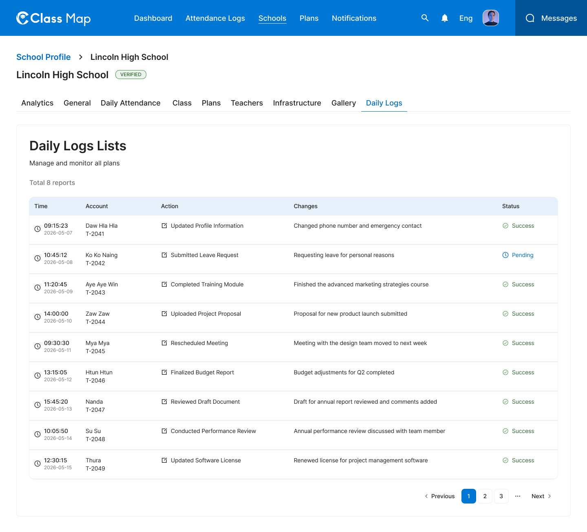

# Daily Logs – Schools



## Flow

```
Admin opens Daily Logs tab
        |
        v
GET /api/v1/admin/schools/{id}/daily-logs   <-- paginated daily log entries
```

## Endpoints

- [GET `/api/v1/admin/schools/{id}/daily-logs`](#1-list-daily-logs) — Paginated list of daily log entries for the school

---

### 1. List Daily Logs

**GET** `/api/v1/admin/schools/{id}/daily-logs`

**Headers**

| Key             | Value                     | Required |
| --------------- | ------------------------- | -------- |
| `Authorization` | `Bearer {{access_token}}` | Yes      |
| `Content-Type`  | `application/json`        | Yes      |
| `X-Request-ID`  | `<uuid>`                  | Yes      |

**Path Parameters**

| Parameter | Type   | Required | Description |
| --------- | ------ | -------- | ----------- |
| `id`      | string | Yes      | School UUID |

**Query Parameters**

| Parameter    | Type    | Required | Description                         |
| ------------ | ------- | -------- | ----------------------------------- |
| `fromDate`   | string  | No       | Start date (ISO 8601: `YYYY-MM-DD`) |
| `toDate`     | string  | No       | End date (ISO 8601: `YYYY-MM-DD`)   |
| `isReviewed` | boolean | No       | Filter by review status             |
| `page`       | integer | No       | Page number (default: 1)            |
| `limit`   | integer | No       | Items per page (default: 10)        |

**Response – 200 OK**

```json
{
  "success": true,
  "data": [
    {
      "id": "log_001",
      "date": "2026-05-07",
      "classTime": "Day School (9:00 AM - 3:00 PM)",
      "customClassStartTime": null,
      "customClassEndTime": null,
      "isReviewed": true,
      "note": "Normal school day",
      "maleCount": 45,
      "femaleCount": 52,
      "swdCount": 8,
      "schoolMaleCount": 48,
      "schoolFemaleCount": 55,
      "schoolSwdCount": 9,
      "teacherName": "Daw Hla Hla"
    },
    {
      "id": "log_002",
      "date": "2026-05-08",
      "classTime": "Day School (9:00 AM - 3:00 PM)",
      "customClassStartTime": null,
      "customClassEndTime": null,
      "isReviewed": false,
      "note": null,
      "maleCount": 42,
      "femaleCount": 56,
      "swdCount": 7,
      "schoolMaleCount": 46,
      "schoolFemaleCount": 59,
      "schoolSwdCount": 8,
      "teacherName": "Ko Ko Naing"
    },
    {
      "id": "log_003",
      "date": "2026-05-09",
      "classTime": "Evening School (3:00 PM - 6:00 PM)",
      "customClassStartTime": "15:30",
      "customClassEndTime": "18:30",
      "isReviewed": true,
      "note": "Extended hours for exam preparation",
      "maleCount": 20,
      "femaleCount": 25,
      "swdCount": 3,
      "schoolMaleCount": 22,
      "schoolFemaleCount": 27,
      "schoolSwdCount": 4,
      "teacherName": "Aye Aye Win"
    }
  ],
  "meta": {
    "page": 1,
    "limit": 10,
    "total": 8,
    "totalPages": 5
  },
  "error": null,
  "message": "Successfully"
}
```

**Response – 4xx / 5xx**

| Status | Error Code              | Description              |
| ------ | ----------------------- | ------------------------ |
| `401`  | `UNAUTHORIZED`          | Missing or invalid token |
| `403`  | `FORBIDDEN`             | Insufficient role        |
| `404`  | `SCHOOL_NOT_FOUND`      | School ID does not exist |
| `429`  | `RATE_LIMIT_EXCEEDED`   | Rate limit exceeded      |
| `500`  | `INTERNAL_SERVER_ERROR` | Unexpected server fault  |

## Error Codes

| Code                    | HTTP Status | Description              |
| ----------------------- | ----------- | ------------------------ |
| `UNAUTHORIZED`          | 401         | Missing or invalid token |
| `FORBIDDEN`             | 403         | Insufficient role        |
| `SCHOOL_NOT_FOUND`      | 404         | School not found         |
| `RATE_LIMIT_EXCEEDED`   | 429         | Too many requests        |
| `INTERNAL_SERVER_ERROR` | 500         | Unexpected server error  |
