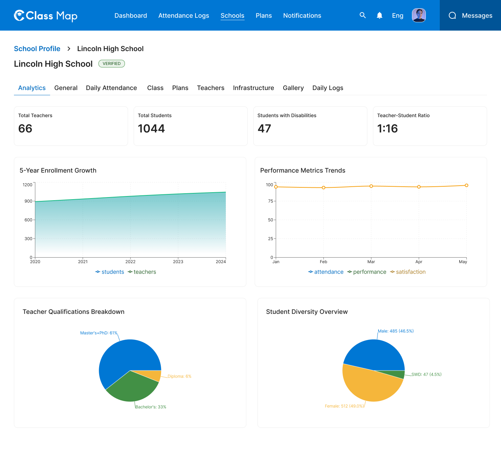
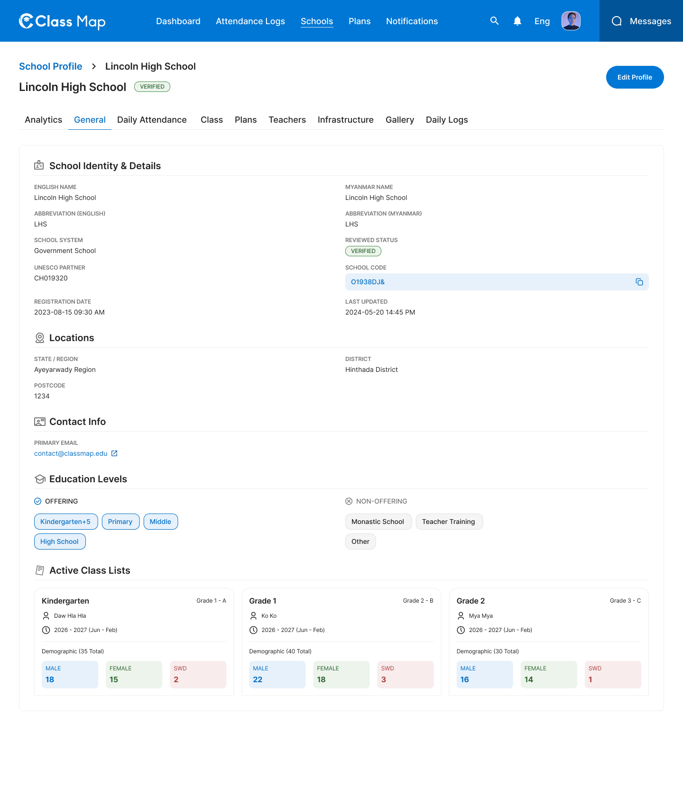

# School Detail – General & Analytics




## Flow

```
Admin clicks school from list
        |
        v
GET /api/v1/admin/schools/{id}           <-- General tab (default)
        |
        v
GET /api/v1/admin/schools/{id}/analytics <-- Analytics tab
        |
Admin clicks "Edit Profile"
        |
        v
PATCH /api/v1/admin/schools/{id}         <-- Save school profile changes

Admin reviews or deletes a school
        |
        +---> POST /api/v1/admin/schools/review   <-- Review school registration
        |
        +---> DELETE /api/v1/admin/schools/{id}   <-- Delete a school
```

## Endpoints

- [GET `/api/v1/admin/schools/{id}`](#1-get-school-detail) — Full school profile (General tab)
- [GET `/api/v1/admin/schools/{id}/analytics`](#2-get-school-analytics) — Analytics charts and stats
- [PATCH `/api/v1/admin/schools/{id}`](#3-update-school-profile) — Update school profile
- [POST `/api/v1/admin/schools/review`](#4-review-school) — Review and approve/reject a school
- [DELETE `/api/v1/admin/schools/{id}`](#5-delete-school) — Permanently delete a school

---

### 1. Get School Detail

**GET** `/api/v1/admin/schools/{id}`

**Headers**

| Key             | Value                     | Required |
| --------------- | ------------------------- | -------- |
| `Authorization` | `Bearer {{access_token}}` | Yes      |
| `Content-Type`  | `application/json`        | Yes      |
| `X-Request-ID`  | `<uuid>`                  | Yes      |

**Path Parameters**

| Parameter | Type   | Required | Description |
| --------- | ------ | -------- | ----------- |
| `id`      | string | Yes      | School UUID |

**Query Parameters**

| Parameter         | Type    | Required | Description                            |
| ----------------- | ------- | -------- | -------------------------------------- |
| `includeTeachers` | boolean | No       | Include teacher list (default: false)  |
| `includeDrafts`   | boolean | No       | Include draft schools (default: false) |

**Response – 200 OK**

```json
{
  "success": true,
  "data": {
    "id": "sch_001",
    "schoolCode": "O1938DJ&",
    "title": null,
    "name": "Lincoln High School",
    "nameMm": "Lincoln High School",
    "abbreviation": "LHS",
    "abbreviationMm": "LHS",
    "schoolStatus": "valid",
    "schoolSystem": { "id": "gov", "name": "Government School" },
    "partnerUser": { "id": "ch01", "displayedName": "CH019320" },
    "state": { "id": "ayey", "name": "Ayeyarwady Region" },
    "district": { "id": "hin", "name": "Hinthada District" },
    "township": { "id": "hin_01", "name": "Hinthada" },
    "educationLevel": { "id": "pri", "name": "Primary" },
    "postcode": "1234",
    "address1": "123 Main Road",
    "phoneNumber": "+951234567",
    "email": "contact@classmap.edu",
    "internetAccess": true,
    "memo": null,
    "otherSpecify": null,
    "disabilityNote": null,
    "reviewResult": null,
    "isPending": false,
    "isDraft": false,
    "currentStep": null,
    "status": true,
    "createdAt": "2023-08-15T09:30:00Z",
    "updatedAt": "2024-05-20T14:45:00Z",
    "teachers": [
      {
        "id": "tch_001",
        "name": "Daw Hla Hla",
        "isPrincipal": true
      }
    ]
  },
  "meta": null,
  "error": null,
  "message": "Successfully"
}
```

**Response – 4xx / 5xx**

| Status | Error Code              | Description              |
| ------ | ----------------------- | ------------------------ |
| `400`  | `VALIDATION_ERROR`      | Invalid school ID format |
| `401`  | `UNAUTHORIZED`          | Missing or invalid token |
| `403`  | `FORBIDDEN`             | Insufficient role        |
| `404`  | `SCHOOL_NOT_FOUND`      | School ID does not exist |
| `429`  | `RATE_LIMIT_EXCEEDED`   | Rate limit exceeded      |
| `500`  | `INTERNAL_SERVER_ERROR` | Unexpected server fault  |

---

### 2. Get School Analytics

**GET** `/api/v1/admin/schools/{id}/analytics`

**Headers**

| Key             | Value                     | Required |
| --------------- | ------------------------- | -------- |
| `Authorization` | `Bearer {{access_token}}` | Yes      |
| `Content-Type`  | `application/json`        | Yes      |
| `X-Request-ID`  | `<uuid>`                  | Yes      |

**Path Parameters**

| Parameter | Type   | Required | Description |
| --------- | ------ | -------- | ----------- |
| `id`      | string | Yes      | School UUID |

**Response – 200 OK**

```json
{
  "success": true,
  "data": {
    "summary": {
      "totalTeachers": 66,
      "totalStudents": 1044,
      "studentsWithDisabilities": 47,
      "teacherStudentRatio": "1:16"
    },
    "enrollmentGrowth": [
      { "year": 2020, "students": 900, "teachers": 55 },
      { "year": 2021, "students": 950, "teachers": 58 },
      { "year": 2022, "students": 980, "teachers": 60 },
      { "year": 2023, "students": 1010, "teachers": 63 },
      { "year": 2024, "students": 1044, "teachers": 66 }
    ],
    "performanceMetrics": [
      {
        "month": "Jan",
        "attendance": 98,
        "performance": 95,
        "satisfaction": 99
      },
      {
        "month": "Feb",
        "attendance": 97,
        "performance": 95,
        "satisfaction": 100
      },
      {
        "month": "Mar",
        "attendance": 98,
        "performance": 96,
        "satisfaction": 99
      },
      {
        "month": "Apr",
        "attendance": 97,
        "performance": 95,
        "satisfaction": 100
      },
      {
        "month": "May",
        "attendance": 98,
        "performance": 96,
        "satisfaction": 100
      }
    ],
    "teacherQualifications": {
      "mastersPhd": 61,
      "bachelors": 33,
      "diploma": 6
    },
    "studentDiversity": {
      "male": { "count": 485, "percentage": 46.5 },
      "female": { "count": 512, "percentage": 49.0 },
      "swd": { "count": 47, "percentage": 4.5 }
    }
  },
  "meta": null,
  "error": null,
  "message": "Successfully"
}
```

**Response – 4xx / 5xx**

| Status | Error Code              | Description              |
| ------ | ----------------------- | ------------------------ |
| `401`  | `UNAUTHORIZED`          | Missing or invalid token |
| `403`  | `FORBIDDEN`             | Insufficient role        |
| `404`  | `SCHOOL_NOT_FOUND`      | School ID does not exist |
| `429`  | `RATE_LIMIT_EXCEEDED`   | Rate limit exceeded      |
| `500`  | `INTERNAL_SERVER_ERROR` | Unexpected server fault  |

---

### 3. Update School Profile

**PATCH** `/api/v1/admin/schools/{id}`

**Headers**

| Key             | Value                     | Required |
| --------------- | ------------------------- | -------- |
| `Authorization` | `Bearer {{access_token}}` | Yes      |
| `Content-Type`  | `application/json`        | Yes      |
| `X-Request-ID`  | `<uuid>`                  | Yes      |

**Path Parameters**

| Parameter | Type   | Required | Description |
| --------- | ------ | -------- | ----------- |
| `id`      | string | Yes      | School UUID |

**Request Body**

| Field              | Type    | Required | Description                   |
| ------------------ | ------- | -------- | ----------------------------- |
| `name`             | string  | No       | English school name           |
| `nameMm`           | string  | No       | Myanmar school name           |
| `abbreviation`     | string  | No       | English abbreviation          |
| `abbreviationMm`   | string  | No       | Myanmar abbreviation          |
| `schoolSystemId`   | string  | No       | School system ID              |
| `partnerUserId`    | string  | No       | UNESCO partner user ID        |
| `stateId`          | string  | No       | State ID                      |
| `districtId`       | string  | No       | District ID                   |
| `townshipId`       | string  | No       | Township ID                   |
| `postcode`         | string  | No       | Postal code                   |
| `address1`         | string  | No       | Street address                |
| `phoneNumber`      | string  | No       | Contact phone                 |
| `email`            | string  | No       | Contact email                 |
| `internetAccess`   | boolean | No       | Internet access available     |
| `educationLevelId` | string  | No       | Education level ID            |
| `title`            | string  | No       | School title                  |
| `otherSpecify`     | string  | No       | Other specification           |
| `memo`             | string  | No       | Internal memo                 |
| `disabilityNote`   | string  | No       | Disability accommodation note |

```json
{
  "name": "Lincoln High School",
  "nameMm": "Lincoln High School",
  "abbreviation": "LHS",
  "schoolSystemId": "gov",
  "stateId": "ayey",
  "districtId": "hin",
  "townshipId": "hin_01",
  "postcode": "1234",
  "address1": "123 Main Road",
  "phoneNumber": "+951234567",
  "email": "contact@classmap.edu",
  "internetAccess": true,
  "educationLevelId": "pri",
  "title": null,
  "otherSpecify": null,
  "memo": null,
  "disabilityNote": null
}
```

**Response – 200 OK**

```json
{
  "success": true,
  "data": {
    "id": "sch_001",
    "name": "Lincoln High School",
    "updatedAt": "2026-05-08T10:00:00Z"
  },
  "meta": null,
  "error": null,
  "message": "School profile updated successfully"
}
```

**Response – 4xx / 5xx**

| Status | Error Code                | Description                     |
| ------ | ------------------------- | ------------------------------- |
| `400`  | `VALIDATION_ERROR`        | Invalid input fields            |
| `401`  | `UNAUTHORIZED`            | Missing or invalid token        |
| `403`  | `FORBIDDEN`               | Insufficient role               |
| `404`  | `SCHOOL_NOT_FOUND`        | School ID does not exist        |
| `409`  | `CONFLICT`                | Concurrent update conflict      |
| `422`  | `BUSINESS_RULE_VIOLATION` | Business rule validation failed |
| `429`  | `RATE_LIMIT_EXCEEDED`     | Rate limit exceeded             |
| `500`  | `INTERNAL_SERVER_ERROR`   | Unexpected server fault         |

---

### 4. Review School

**POST** `/api/v1/admin/schools/review`

**Headers**

| Key             | Value                     | Required |
| --------------- | ------------------------- | -------- |
| `Authorization` | `Bearer {{access_token}}` | Yes      |
| `Content-Type`  | `application/json`        | Yes      |
| `X-Request-ID`  | `<uuid>`                  | Yes      |

**Request Body**

| Field          | Type   | Required | Description                                    |
| -------------- | ------ | -------- | ---------------------------------------------- |
| `schoolId`     | string | Yes      | School UUID                                    |
| `reviewStatus` | string | Yes      | Review decision: `valid`, `invalid`, `pending` |
| `reviewReason` | string | No       | Reason for the review decision                 |

```json
{
  "schoolId": "sch_001",
  "reviewStatus": "valid",
  "reviewReason": "All documents verified and school meets requirements."
}
```

**Response – 200 OK**

```json
{
  "success": true,
  "data": {
    "reviewed": true,
    "status": "valid",
    "createdUserIds": ["usr_001", "usr_002"]
  },
  "meta": null,
  "error": null,
  "message": "School reviewed successfully"
}
```

**Response – 4xx / 5xx**

| Status | Error Code                | Description                     |
| ------ | ------------------------- | ------------------------------- |
| `400`  | `VALIDATION_ERROR`        | Invalid review status           |
| `401`  | `UNAUTHORIZED`            | Missing or invalid token        |
| `403`  | `FORBIDDEN`               | Insufficient role               |
| `404`  | `SCHOOL_NOT_FOUND`        | School ID does not exist        |
| `422`  | `BUSINESS_RULE_VIOLATION` | Business rule validation failed |
| `429`  | `RATE_LIMIT_EXCEEDED`     | Rate limit exceeded             |
| `500`  | `INTERNAL_SERVER_ERROR`   | Unexpected server fault         |

---

### 5. Delete School

**DELETE** `/api/v1/admin/schools/{id}`

**Headers**

| Key             | Value                     | Required |
| --------------- | ------------------------- | -------- |
| `Authorization` | `Bearer {{access_token}}` | Yes      |
| `X-Request-ID`  | `<uuid>`                  | Yes      |

**Path Parameters**

| Parameter | Type   | Required | Description |
| --------- | ------ | -------- | ----------- |
| `id`      | string | Yes      | School UUID |

**Response – 200 OK**

```json
{
  "success": true,
  "data": "School deleted",
  "meta": null,
  "error": null,
  "message": "School deleted successfully"
}
```

**Response – 4xx / 5xx**

| Status | Error Code              | Description              |
| ------ | ----------------------- | ------------------------ |
| `401`  | `UNAUTHORIZED`          | Missing or invalid token |
| `403`  | `FORBIDDEN`             | Insufficient role        |
| `404`  | `SCHOOL_NOT_FOUND`      | School ID does not exist |
| `429`  | `RATE_LIMIT_EXCEEDED`   | Rate limit exceeded      |
| `500`  | `INTERNAL_SERVER_ERROR` | Unexpected server fault  |

## Error Codes

| Code                      | HTTP Status | Description                     |
| ------------------------- | ----------- | ------------------------------- |
| `VALIDATION_ERROR`        | 400         | Invalid or missing fields       |
| `UNAUTHORIZED`            | 401         | Missing or invalid token        |
| `FORBIDDEN`               | 403         | Insufficient role               |
| `SCHOOL_NOT_FOUND`        | 404         | School not found                |
| `CONFLICT`                | 409         | Concurrent update conflict      |
| `BUSINESS_RULE_VIOLATION` | 422         | Business rule validation failed |
| `RATE_LIMIT_EXCEEDED`     | 429         | Too many requests               |
| `INTERNAL_SERVER_ERROR`   | 500         | Unexpected server error         |
