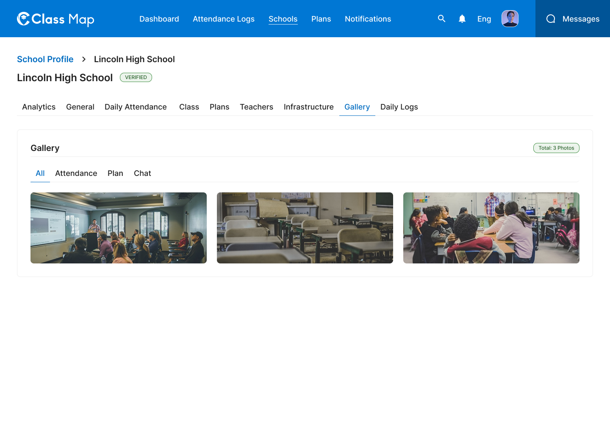

# School Gallery – Schools



## Flow

```
Admin opens Gallery tab
        |
        v
GET /api/v1/admin/schools/{id}/gallery          <-- default: all photos
        |
Admin selects category filter (All / Attendance / Plan / Chat)
        |
        v
GET /api/v1/admin/schools/{id}/gallery?category=attendance
```

## Endpoints

- [GET `/api/v1/admin/schools/{id}/gallery`](#1-list-school-gallery) — Paginated photo gallery with category filter

---

### 1. List School Gallery

**GET** `/api/v1/admin/schools/{id}/gallery`

**Headers**

| Key             | Value                     | Required |
| --------------- | ------------------------- | -------- |
| `Authorization` | `Bearer {{access_token}}` | Yes      |
| `Content-Type`  | `application/json`        | Yes      |
| `X-Request-ID`  | `<uuid>`                  | Yes      |

**Path Parameters**

| Parameter | Type   | Required | Description |
| --------- | ------ | -------- | ----------- |
| `id`      | string | Yes      | School UUID |

**Query Parameters**

| Parameter  | Type    | Required | Description                                                     |
| ---------- | ------- | -------- | --------------------------------------------------------------- |
| `category` | string  | No       | Filter by category: `attendance`, `plan`, `chat` (omit for all) |
| `page`     | integer | No       | Page number (default: 1)                                        |
| `limit` | integer | No       | Items per page (default: 20)                                    |

**Response – 200 OK**

```json
{
  "success": true,
  "data": [
    {
      "id": "img_001",
      "category": "attendance",
      "url": "https://storage.example.com/gallery/img_001.jpg",
      "thumbnailUrl": "https://storage.example.com/gallery/thumb_001.jpg",
      "createdAt": "2026-05-01T09:00:00Z"
    },
    {
      "id": "img_002",
      "category": "plan",
      "url": "https://storage.example.com/gallery/img_002.jpg",
      "thumbnailUrl": "https://storage.example.com/gallery/thumb_002.jpg",
      "createdAt": "2026-05-02T14:30:00Z"
    },
    {
      "id": "img_003",
      "category": "chat",
      "url": "https://storage.example.com/gallery/img_003.jpg",
      "thumbnailUrl": "https://storage.example.com/gallery/thumb_003.jpg",
      "createdAt": "2026-05-03T11:15:00Z"
    }
  ],
  "meta": {
    "page": 1,
    "limit": 20,
    "total": 3,
    "totalPages": 5
  },
  "error": null,
  "message": "Successfully"
}
```

**Response – 4xx / 5xx**

| Status | Error Code              | Description              |
| ------ | ----------------------- | ------------------------ |
| `400`  | `VALIDATION_ERROR`      | Invalid category value   |
| `401`  | `UNAUTHORIZED`          | Missing or invalid token |
| `403`  | `FORBIDDEN`             | Insufficient role        |
| `404`  | `SCHOOL_NOT_FOUND`      | School ID does not exist |
| `429`  | `RATE_LIMIT_EXCEEDED`   | Rate limit exceeded      |
| `500`  | `INTERNAL_SERVER_ERROR` | Unexpected server fault  |

## Error Codes

| Code                    | HTTP Status | Description              |
| ----------------------- | ----------- | ------------------------ |
| `VALIDATION_ERROR`      | 400         | Invalid category value   |
| `UNAUTHORIZED`          | 401         | Missing or invalid token |
| `FORBIDDEN`             | 403         | Insufficient role        |
| `SCHOOL_NOT_FOUND`      | 404         | School not found         |
| `RATE_LIMIT_EXCEEDED`   | 429         | Too many requests        |
| `INTERNAL_SERVER_ERROR` | 500         | Unexpected server error  |
