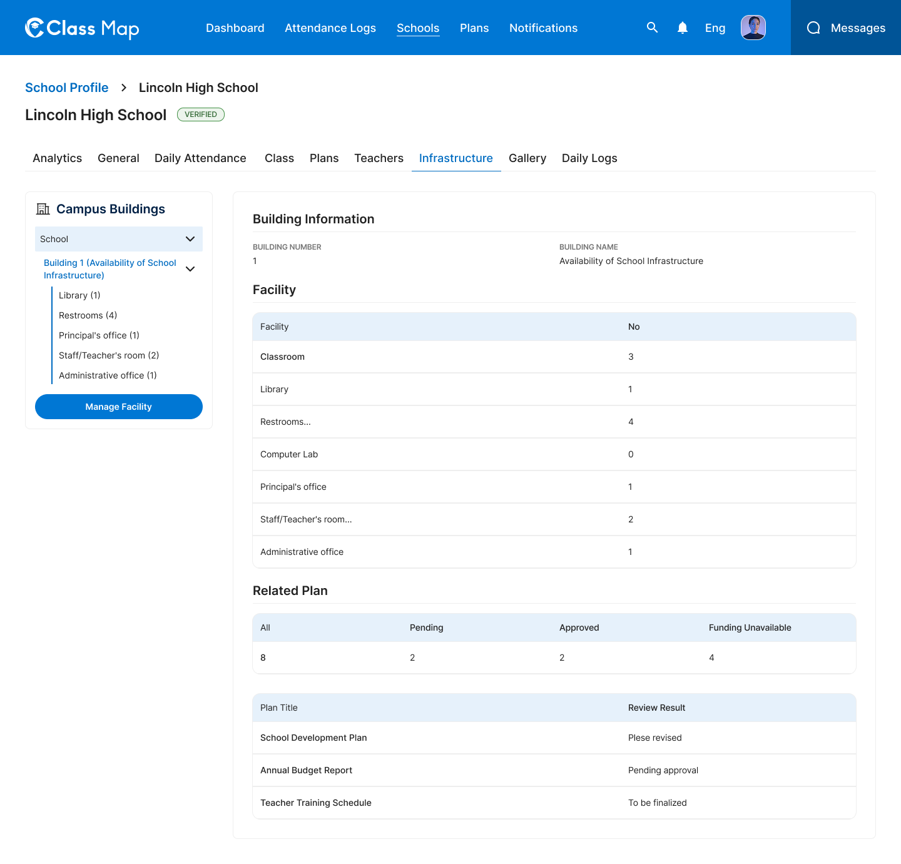

# School Infrastructure – Schools



## Flow

```
Admin opens Infrastructure tab
        |
        v
GET /api/v1/admin/schools/{id}/infrastructure    <-- building list + facility counts + related plans
        |
Admin selects a building type (dropdown: School, etc.)
        |
        v
GET /api/v1/admin/schools/{id}/infrastructure?buildingType=school
        |
Admin clicks "Manage Facility"
        |
        v
PATCH /api/v1/admin/schools/{id}/infrastructure/{building_id}
```

## Endpoints

- [GET `/api/v1/admin/schools/{id}/infrastructure`](#1-get-school-infrastructure) — Buildings, facility counts, and related plans
- [PATCH `/api/v1/admin/schools/{id}/infrastructure/{building_id}`](#2-update-building-facility) — Update facility counts for a building

---

### 1. Get School Infrastructure

**GET** `/api/v1/admin/schools/{id}/infrastructure`

**Headers**

| Key             | Value                     | Required |
| --------------- | ------------------------- | -------- |
| `Authorization` | `Bearer {{access_token}}` | Yes      |
| `Content-Type`  | `application/json`        | Yes      |
| `X-Request-ID`  | `<uuid>`                  | Yes      |

**Path Parameters**

| Parameter | Type   | Required | Description |
| --------- | ------ | -------- | ----------- |
| `id`      | string | Yes      | School UUID |

**Query Parameters**

| Parameter      | Type   | Required | Description                                                  |
| -------------- | ------ | -------- | ------------------------------------------------------------ |
| `buildingType` | string | No       | Filter by type: `school`, `hostel`, etc. (default: `school`) |

**Response – 200 OK**

```json
{
  "success": true,
  "data": {
    "buildings": [
      {
        "id": "bld_001",
        "title": "Availability of School Infrastructure",
        "buildingFacilities": [
          {
            "id": "bf_001",
            "name": "Classroom",
            "count": 3,
            "otherSpecify": null,
            "buildingFacilityTypeId": "cls"
          },
          {
            "id": "bf_002",
            "name": "Library",
            "count": 1,
            "otherSpecify": null,
            "buildingFacilityTypeId": "lib"
          },
          {
            "id": "bf_003",
            "name": "Restrooms",
            "count": 4,
            "otherSpecify": null,
            "buildingFacilityTypeId": "rest"
          },
          {
            "id": "bf_004",
            "name": "Computer Lab",
            "count": 0,
            "otherSpecify": null,
            "buildingFacilityTypeId": "comp"
          },
          {
            "id": "bf_005",
            "name": "Principal's office",
            "count": 1,
            "otherSpecify": null,
            "buildingFacilityTypeId": "prin"
          },
          {
            "id": "bf_006",
            "name": "Staff/Teacher's room",
            "count": 2,
            "otherSpecify": null,
            "buildingFacilityTypeId": "staff"
          },
          {
            "id": "bf_007",
            "name": "Administrative office",
            "count": 1,
            "otherSpecify": null,
            "buildingFacilityTypeId": "admin"
          }
        ]
      }
    ],
    "equipment": [
      {
        "id": "eq_001",
        "name": "Desktop Computer",
        "count": 10,
        "otherSpecify": null,
        "equipmentTypeId": "desktop"
      },
      {
        "id": "eq_002",
        "name": "Projector",
        "count": 2,
        "otherSpecify": null,
        "equipmentTypeId": "proj"
      }
    ],
    "relatedPlans": {
      "summary": {
        "total": 8,
        "pending": 2,
        "approved": 2,
        "funding_unavailable": 4
      },
      "plans": [
        {
          "id": "plan_001",
          "title": "School Development Plan",
          "reviewResult": "Please revised"
        },
        {
          "id": "plan_002",
          "title": "Annual Budget Report",
          "reviewResult": "Pending approval"
        },
        {
          "id": "plan_003",
          "title": "Teacher Training Schedule",
          "reviewResult": "To be finalized"
        }
      ]
    }
  },
  "meta": null,
  "error": null,
  "message": "Successfully"
}
```

**Response – 4xx / 5xx**

| Status | Error Code              | Description              |
| ------ | ----------------------- | ------------------------ |
| `401`  | `UNAUTHORIZED`          | Missing or invalid token |
| `403`  | `FORBIDDEN`             | Insufficient role        |
| `404`  | `SCHOOL_NOT_FOUND`      | School ID does not exist |
| `429`  | `RATE_LIMIT_EXCEEDED`   | Rate limit exceeded      |
| `500`  | `INTERNAL_SERVER_ERROR` | Unexpected server fault  |

---

### 2. Update Building Facility

**PATCH** `/api/v1/admin/schools/{id}/infrastructure/{building_id}`

**Headers**

| Key             | Value                     | Required |
| --------------- | ------------------------- | -------- |
| `Authorization` | `Bearer {{access_token}}` | Yes      |
| `Content-Type`  | `application/json`        | Yes      |
| `X-Request-ID`  | `<uuid>`                  | Yes      |

**Path Parameters**

| Parameter     | Type   | Required | Description   |
| ------------- | ------ | -------- | ------------- |
| `id`          | string | Yes      | School UUID   |
| `building_id` | string | Yes      | Building UUID |

**Request Body**

| Field                | Type  | Required | Description                |
| -------------------- | ----- | -------- | -------------------------- |
| `buildingFacilities` | array | Yes      | Array of facility objects  |
| `equipment`          | array | Yes      | Array of equipment objects |

```json
{
  "buildingFacilities": [
    {
      "id": "bf_001",
      "name": "Classroom",
      "count": 4,
      "otherSpecify": null,
      "buildingFacilityTypeId": "cls"
    },
    {
      "id": "bf_002",
      "name": "Library",
      "count": 1,
      "otherSpecify": null,
      "buildingFacilityTypeId": "lib"
    },
    {
      "id": "bf_003",
      "name": "Restrooms",
      "count": 5,
      "otherSpecify": null,
      "buildingFacilityTypeId": "rest"
    },
    {
      "id": "bf_004",
      "name": "Computer Lab",
      "count": 1,
      "otherSpecify": null,
      "buildingFacilityTypeId": "comp"
    },
    {
      "id": "bf_005",
      "name": "Principal's office",
      "count": 1,
      "otherSpecify": null,
      "buildingFacilityTypeId": "prin"
    },
    {
      "id": "bf_006",
      "name": "Staff/Teacher's room",
      "count": 2,
      "otherSpecify": null,
      "buildingFacilityTypeId": "staff"
    },
    {
      "id": "bf_007",
      "name": "Administrative office",
      "count": 1,
      "otherSpecify": null,
      "buildingFacilityTypeId": "admin"
    }
  ],
  "equipment": [
    {
      "id": "eq_001",
      "name": "Desktop Computer",
      "count": 10,
      "otherSpecify": null,
      "equipmentTypeId": "desktop"
    },
    {
      "id": "eq_002",
      "name": "Projector",
      "count": 2,
      "otherSpecify": null,
      "equipmentTypeId": "proj"
    }
  ]
}
```

**Response – 200 OK**

```json
{
  "success": true,
  "data": {
    "buildingId": "bld_001",
    "title": "Availability of School Infrastructure",
    "buildingFacilities": [
      {
        "id": "bf_001",
        "name": "Classroom",
        "count": 4,
        "otherSpecify": null,
        "buildingFacilityTypeId": "cls"
      },
      {
        "id": "bf_002",
        "name": "Library",
        "count": 1,
        "otherSpecify": null,
        "buildingFacilityTypeId": "lib"
      }
    ],
    "updatedAt": "2026-05-08T10:00:00Z"
  },
  "meta": null,
  "error": null,
  "message": "Facility updated successfully"
}
```

**Response – 4xx / 5xx**

| Status | Error Code              | Description                |
| ------ | ----------------------- | -------------------------- |
| `400`  | `VALIDATION_ERROR`      | Invalid facility data      |
| `401`  | `UNAUTHORIZED`          | Missing or invalid token   |
| `403`  | `FORBIDDEN`             | Insufficient role          |
| `404`  | `BUILDING_NOT_FOUND`    | Building ID does not exist |
| `409`  | `CONFLICT`              | Concurrent update conflict |
| `429`  | `RATE_LIMIT_EXCEEDED`   | Rate limit exceeded        |
| `500`  | `INTERNAL_SERVER_ERROR` | Unexpected server fault    |

## Error Codes

| Code                    | HTTP Status | Description                |
| ----------------------- | ----------- | -------------------------- |
| `VALIDATION_ERROR`      | 400         | Invalid facility data      |
| `UNAUTHORIZED`          | 401         | Missing or invalid token   |
| `FORBIDDEN`             | 403         | Insufficient role          |
| `SCHOOL_NOT_FOUND`      | 404         | School not found           |
| `BUILDING_NOT_FOUND`    | 404         | Building not found         |
| `CONFLICT`              | 409         | Concurrent update conflict |
| `RATE_LIMIT_EXCEEDED`   | 429         | Too many requests          |
| `INTERNAL_SERVER_ERROR` | 500         | Unexpected server error    |
