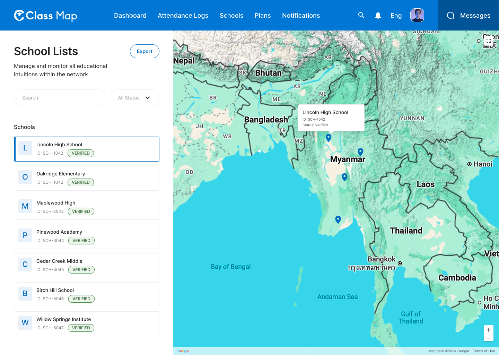

# School Lists – Schools



## Flow

```
Admin navigates to Schools
        |
        v
GET /api/v1/admin/schools   <-- paginated list with search + status filter
        |
        v
Map pins + sidebar list rendered
```

## Endpoints

- [GET `/api/v1/admin/schools`](#1-list-schools) — Paginated list of all schools with map data

---

### 1. List Schools
**GET** `/api/v1/admin/schools`

**Headers**

| Key | Value | Required |
|---|---|---|
| `Authorization` | `Bearer {{access_token}}` | Yes |
| `Content-Type` | `application/json` | Yes |
| `X-Request-ID` | `<uuid>` | Yes |

**Query Parameters**

| Parameter | Type | Required | Description |
|---|---|---|---|
| `page` | integer | No | Page number (default: 1) |
| `per_page` | integer | No | Items per page (default: 20) |
| `search` | string | No | Search by school name |
| `status` | string | No | Filter by status: `active`, `archived` |
| `state` | string | No | Filter by state/region |

**Response – 200 OK**

```json
{
  "success": true,
  "data": [
    {
      "id": "sch_001",
      "name_en": "Lincoln High School",
      "name_mm": "Lincoln High School",
      "abbreviation": "LHS",
      "status": "active",
      "review_status": "verified",
      "school_system": "Government School",
      "location": {
        "state": "Ayeyarwady Region",
        "district": "Hinthada District",
        "postcode": "1234",
        "coordinates": {
          "latitude": 17.6476,
          "longitude": 95.4620
        }
      }
    },
    {
      "id": "sch_002",
      "name_en": "Oakridge Elementary",
      "name_mm": "Oakridge Elementary",
      "abbreviation": "OE",
      "status": "active",
      "review_status": "verified",
      "school_system": "Government School",
      "location": {
        "state": "Yangon Region",
        "district": "Yangon District",
        "postcode": "11001",
        "coordinates": {
          "latitude": 16.8661,
          "longitude": 96.1951
        }
      }
    }
  ],
  "meta": {
    "page": 1,
    "per_page": 20,
    "total": 1248
  },
  "error": null,
  "message": "Successfully"
}
```

**Response – 4xx / 5xx**

| Status | Error Code | Description |
|---|---|---|
| `400` | `VALIDATION_ERROR` | Invalid query parameters |
| `401` | `UNAUTHORIZED` | Missing or invalid token |
| `403` | `FORBIDDEN` | Insufficient role |
| `429` | `RATE_LIMIT_EXCEEDED` | Rate limit exceeded |
| `500` | `INTERNAL_SERVER_ERROR` | Unexpected server fault |

## Error Codes

| Code | HTTP Status | Description |
|---|---|---|
| `VALIDATION_ERROR` | 400 | Invalid query parameter value |
| `UNAUTHORIZED` | 401 | Missing or invalid token |
| `FORBIDDEN` | 403 | Insufficient role |
| `RATE_LIMIT_EXCEEDED` | 429 | Too many requests |
| `INTERNAL_SERVER_ERROR` | 500 | Unexpected server error |
