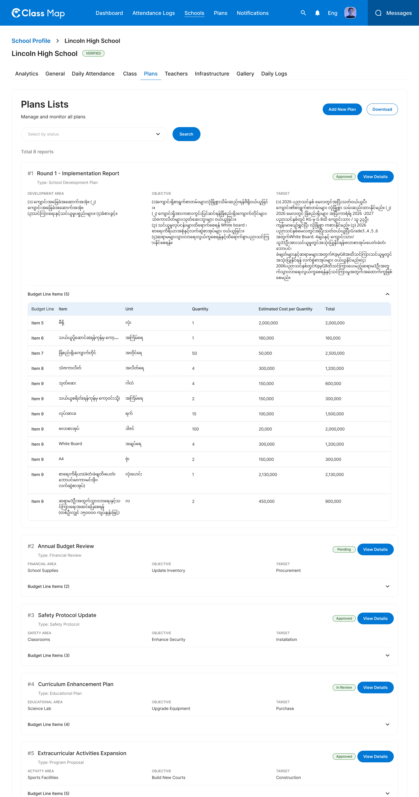
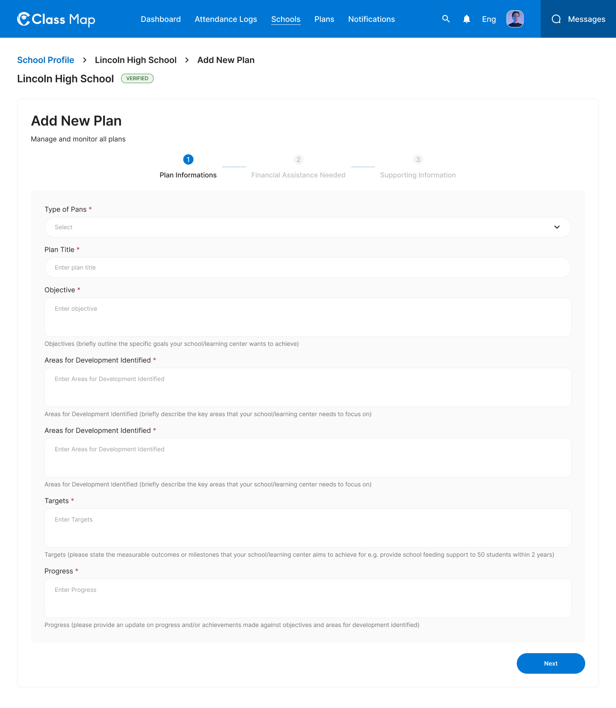
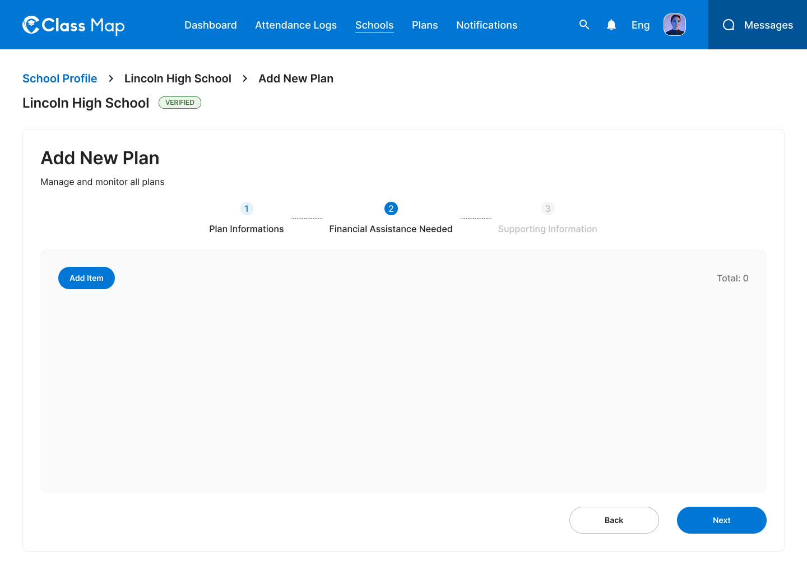
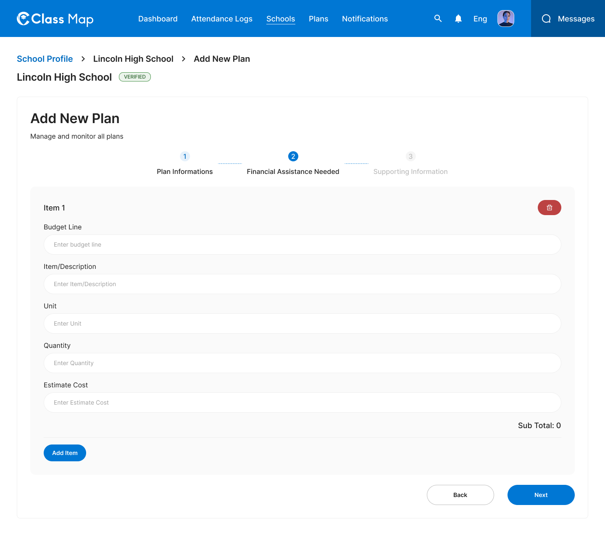
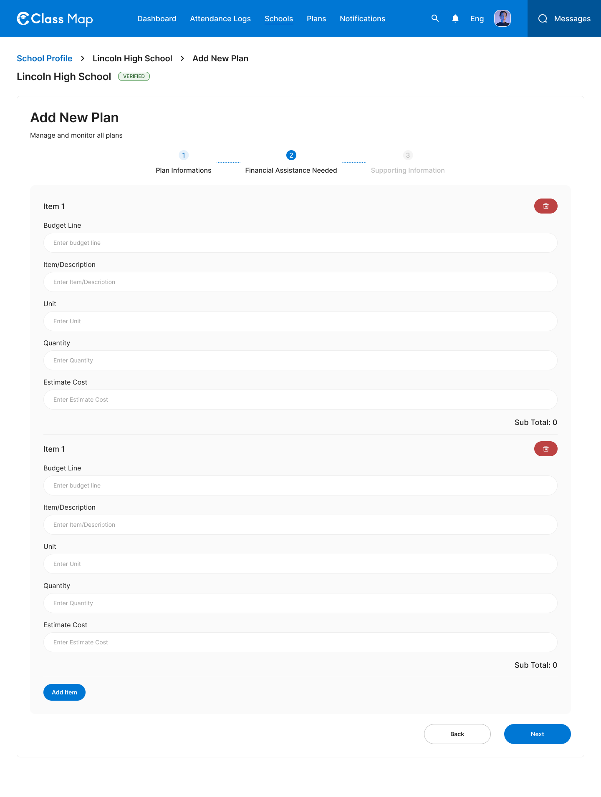
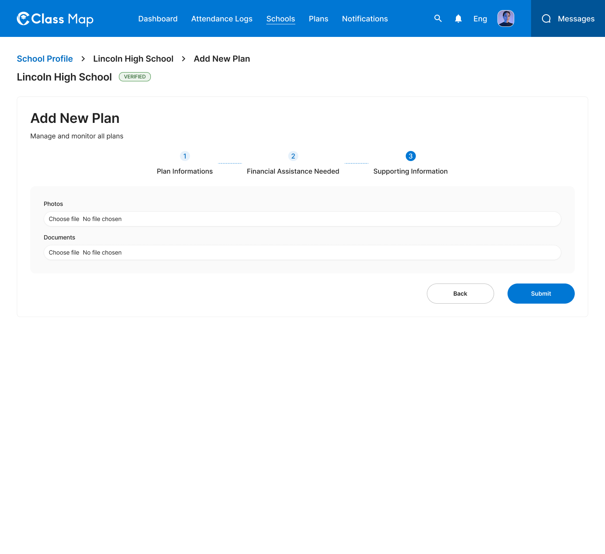
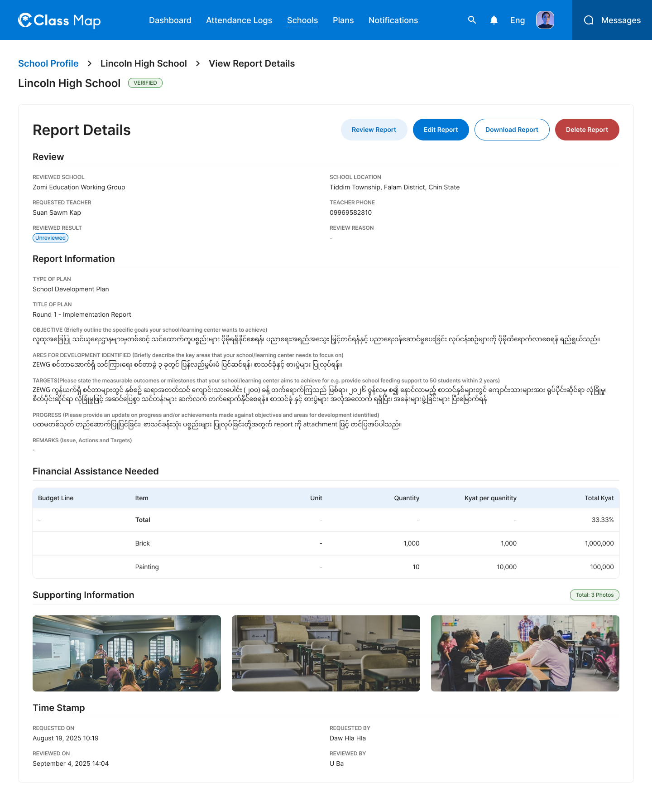

# School Plans – Schools









## Flow

```
Admin opens Plans tab
        |
        v
GET /api/v1/admin/schools/{id}/plans         <-- list plans (filterable by status)
        |
        +---> Admin clicks "Add New Plan"
        |       Step 1: Plan Information (type, title, objective, areas, targets, progress)
        |       Step 2: Financial Assistance (budget line items, add/remove items)
        |       Step 3: Supporting Information (photos upload, documents upload)
        |              |
        |              v (Submit)
        |     POST /api/v1/admin/schools/{id}/plans  (multipart/form-data)
        |
        +---> Admin clicks "View Details"
        |              |
        |              v
        |     GET /api/v1/admin/schools/{id}/plans/{plan_id}
        |              |
        |              +---> "Edit Report"
        |              |         v
        |              |    PUT /api/v1/admin/schools/{id}/plans/{plan_id}
        |              |
        |              +---> "Review Report"
        |              |         v
        |              |    POST /api/v1/admin/schools/{id}/plans/{plan_id}/review
        |              |
        |              +---> "Delete Report"
        |                        v
        |                   DELETE /api/v1/admin/schools/{id}/plans/{plan_id}
        |
        +---> Admin clicks "Download"
                       v
             GET /api/v1/admin/schools/{id}/plans/export
```

## Endpoints

- [GET `/api/v1/admin/schools/{id}/plans`](#1-list-plans) — Paginated list of plans with status filter
- [POST `/api/v1/admin/schools/{id}/plans`](#2-create-plan) — Submit new plan (3-step form as multipart)
- [GET `/api/v1/admin/schools/{id}/plans/{plan_id}`](#3-get-plan-detail) — Full plan report detail
- [PUT `/api/v1/admin/schools/{id}/plans/{plan_id}`](#4-update-plan) — Full replace of a plan
- [DELETE `/api/v1/admin/schools/{id}/plans/{plan_id}`](#5-delete-plan) — Remove a plan
- [POST `/api/v1/admin/schools/{id}/plans/{plan_id}/review`](#6-review-plan) — Submit review decision
- [GET `/api/v1/admin/schools/{id}/plans/export`](#7-export-plans) — Download plans list

---

### 1. List Plans

**GET** `/api/v1/admin/schools/{id}/plans`

**Headers**

| Key             | Value                     | Required |
| --------------- | ------------------------- | -------- |
| `Authorization` | `Bearer {{access_token}}` | Yes      |
| `Content-Type`  | `application/json`        | Yes      |
| `X-Request-ID`  | `<uuid>`                  | Yes      |

**Path Parameters**

| Parameter | Type   | Required | Description |
| --------- | ------ | -------- | ----------- |
| `id`      | string | Yes      | School UUID |

**Query Parameters**

| Parameter  | Type    | Required | Description                                                        |
| ---------- | ------- | -------- | ------------------------------------------------------------------ |
| `status`   | string  | No       | Filter: `unreviewed`, `approved`, `funding_unavailable`, `pending` |
| `page`     | integer | No       | Page number (default: 1)                                           |
| `limit` | integer | No       | Items per page (default: 10)                                       |

**Response – 200 OK**

```json
{
  "success": true,
  "data": [
    {
      "id": "plan_001",
      "reportType": { "id": "sdp", "name": "School Development Plan" },
      "title": "Round 1 – Implementation Report",
      "reportStatus": "approved",
      "reportObjective": "...",
      "reportTarget": "...",
      "reportRequestItems": [
        {
          "name": "Brick",
          "number": "Item A",
          "count": 1000,
          "cost": 1000,
          "unit": "pcs"
        }
      ],
      "createdAt": "2026-01-10T08:00:00Z"
    },
    {
      "id": "plan_002",
      "reportType": { "id": "abr", "name": "Annual Budget Review" },
      "title": "Annual Supplies",
      "reportStatus": "unreviewed",
      "reportObjective": "Upgrade Inventory",
      "reportTarget": "Procurement",
      "reportRequestItems": [],
      "createdAt": "2026-02-05T09:30:00Z"
    }
  ],
  "meta": {
    "page": 1,
    "limit": 10,
    "total": 8,
    "totalPages": 5
  },
  "error": null,
  "message": "Successfully"
}
```

**Response – 4xx / 5xx**

| Status | Error Code              | Description              |
| ------ | ----------------------- | ------------------------ |
| `401`  | `UNAUTHORIZED`          | Missing or invalid token |
| `403`  | `FORBIDDEN`             | Insufficient role        |
| `404`  | `SCHOOL_NOT_FOUND`      | School ID does not exist |
| `429`  | `RATE_LIMIT_EXCEEDED`   | Rate limit exceeded      |
| `500`  | `INTERNAL_SERVER_ERROR` | Unexpected server fault  |

---

### 2. Create Plan

**POST** `/api/v1/admin/schools/{id}/plans`

**multipart/form-data**

**Headers**

| Key             | Value                     | Required |
| --------------- | ------------------------- | -------- |
| `Authorization` | `Bearer {{access_token}}` | Yes      |
| `Content-Type`  | `multipart/form-data`     | Yes      |
| `X-Request-ID`  | `<uuid>`                  | Yes      |

**Path Parameters**

| Parameter | Type   | Required | Description |
| --------- | ------ | -------- | ----------- |
| `id`      | string | Yes      | School UUID |

**Request Fields**

| Field                | Type                | Required | Description                                           |
| -------------------- | ------------------- | -------- | ----------------------------------------------------- |
| `reportTypeId`       | string              | Yes      | Report type ID                                        |
| `title`              | string              | Yes      | Title of the plan                                     |
| `reportObjective`    | string              | Yes      | Goals the school aims to achieve                      |
| `reportAreaDevInd`   | string (JSON array) | Yes      | Key areas to focus on (JSON-encoded array of strings) |
| `reportTarget`       | string              | Yes      | Measurable outcomes/milestones                        |
| `reportProgress`     | string              | Yes      | Update on progress and achievements                   |
| `memo`               | string              | No       | Additional notes                                      |
| `buildingId`         | string              | No       | Related building ID                                   |
| `reportRequestItems` | string (JSON array) | No       | Budget line items (JSON-encoded array)                |
| `photos`             | file                | No       | Supporting photo files (multiple allowed)             |
| `documents`          | file                | No       | Supporting document files (multiple allowed)          |

**reportRequestItems JSON structure:**

```json
[
  {
    "name": "Brick",
    "number": "Item A",
    "count": 1000,
    "cost": 1000,
    "unit": "pcs"
  },
  {
    "name": "Painting",
    "number": "Item B",
    "count": 10,
    "cost": 10000,
    "unit": "sets"
  }
]
```

**Response – 201 Created**

```json
{
  "success": true,
  "data": {
    "id": "plan_009",
    "reportType": { "id": "sdp", "name": "School Development Plan" },
    "title": "2026 Infrastructure Upgrade",
    "reportStatus": "unreviewed",
    "createdAt": "2026-05-08T10:00:00Z"
  },
  "meta": null,
  "error": null,
  "message": "Plan submitted successfully"
}
```

**Response – 4xx / 5xx**

| Status | Error Code                | Description              |
| ------ | ------------------------- | ------------------------ |
| `400`  | `VALIDATION_ERROR`        | Missing required fields  |
| `401`  | `UNAUTHORIZED`            | Missing or invalid token |
| `403`  | `FORBIDDEN`               | Insufficient role        |
| `404`  | `SCHOOL_NOT_FOUND`        | School ID does not exist |
| `422`  | `BUSINESS_RULE_VIOLATION` | Business rule violation  |
| `429`  | `RATE_LIMIT_EXCEEDED`     | Rate limit exceeded      |
| `500`  | `INTERNAL_SERVER_ERROR`   | Unexpected server fault  |

---

### 3. Get Plan Detail

**GET** `/api/v1/admin/schools/{id}/plans/{plan_id}`

**Headers**

| Key             | Value                     | Required |
| --------------- | ------------------------- | -------- |
| `Authorization` | `Bearer {{access_token}}` | Yes      |
| `Content-Type`  | `application/json`        | Yes      |
| `X-Request-ID`  | `<uuid>`                  | Yes      |

**Path Parameters**

| Parameter | Type   | Required | Description |
| --------- | ------ | -------- | ----------- |
| `id`      | string | Yes      | School UUID |
| `plan_id` | string | Yes      | Plan UUID   |

**Response – 200 OK**

```json
{
  "success": true,
  "data": {
    "id": "plan_001",
    "reportType": { "id": "sdp", "name": "School Development Plan" },
    "title": "Round 1 – Implementation Report",
    "reportObjective": "...",
    "reportAreaDevInd": ["Infrastructure", "Teacher Training"],
    "reportTarget": "...",
    "reportProgress": "...",
    "memo": "...",
    "reportStatus": "approved",
    "reviewResult": "Approved with minor revisions",
    "reviewDate": "2026-09-04T15:54:00Z",
    "buildingId": null,
    "reportRequestItems": [
      {
        "name": "Brick",
        "number": "Item A",
        "count": 1000,
        "cost": 1000,
        "unit": "pcs"
      },
      {
        "name": "Painting",
        "number": "Item B",
        "count": 10,
        "cost": 10000,
        "unit": "sets"
      }
    ],
    "reportPhotos": [
      {
        "id": "img_001",
        "url": "https://storage.example.com/plans/img_001.jpg"
      }
    ],
    "reportDocs": [],
    "createdAt": "2026-03-10T10:38:18Z",
    "updatedAt": "2026-09-04T15:54:00Z"
  },
  "meta": null,
  "error": null,
  "message": "Successfully"
}
```

**Response – 4xx / 5xx**

| Status | Error Code              | Description              |
| ------ | ----------------------- | ------------------------ |
| `401`  | `UNAUTHORIZED`          | Missing or invalid token |
| `403`  | `FORBIDDEN`             | Insufficient role        |
| `404`  | `PLAN_NOT_FOUND`        | Plan ID does not exist   |
| `429`  | `RATE_LIMIT_EXCEEDED`   | Rate limit exceeded      |
| `500`  | `INTERNAL_SERVER_ERROR` | Unexpected server fault  |

---

### 4. Update Plan

**PUT** `/api/v1/admin/schools/{id}/plans/{plan_id}`

**multipart/form-data**

**Headers**

| Key             | Value                     | Required |
| --------------- | ------------------------- | -------- |
| `Authorization` | `Bearer {{access_token}}` | Yes      |
| `Content-Type`  | `multipart/form-data`     | Yes      |
| `X-Request-ID`  | `<uuid>`                  | Yes      |

**Path Parameters**

| Parameter | Type   | Required | Description |
| --------- | ------ | -------- | ----------- |
| `id`      | string | Yes      | School UUID |
| `plan_id` | string | Yes      | Plan UUID   |

**Request Fields**

Same fields as [Create Plan](#2-create-plan). All required fields must be included.

**Response – 200 OK**

```json
{
  "success": true,
  "data": {
    "id": "plan_001",
    "title": "Round 1 – Implementation Report (Revised)",
    "reportStatus": "unreviewed",
    "updatedAt": "2026-05-08T11:00:00Z"
  },
  "meta": null,
  "error": null,
  "message": "Plan updated successfully"
}
```

**Response – 4xx / 5xx**

| Status | Error Code                | Description                |
| ------ | ------------------------- | -------------------------- |
| `400`  | `VALIDATION_ERROR`        | Invalid input              |
| `401`  | `UNAUTHORIZED`            | Missing or invalid token   |
| `403`  | `FORBIDDEN`               | Insufficient role          |
| `404`  | `PLAN_NOT_FOUND`          | Plan not found             |
| `409`  | `CONFLICT`                | Concurrent update conflict |
| `422`  | `BUSINESS_RULE_VIOLATION` | Business rule violation    |
| `429`  | `RATE_LIMIT_EXCEEDED`     | Rate limit exceeded        |
| `500`  | `INTERNAL_SERVER_ERROR`   | Unexpected server fault    |

---

### 5. Delete Plan

**DELETE** `/api/v1/admin/schools/{id}/plans/{plan_id}`

**Headers**

| Key             | Value                     | Required |
| --------------- | ------------------------- | -------- |
| `Authorization` | `Bearer {{access_token}}` | Yes      |
| `X-Request-ID`  | `<uuid>`                  | Yes      |

**Path Parameters**

| Parameter | Type   | Required | Description |
| --------- | ------ | -------- | ----------- |
| `id`      | string | Yes      | School UUID |
| `plan_id` | string | Yes      | Plan UUID   |

**Response – 204 No Content**

No body returned.

**Response – 4xx / 5xx**

| Status | Error Code              | Description              |
| ------ | ----------------------- | ------------------------ |
| `401`  | `UNAUTHORIZED`          | Missing or invalid token |
| `403`  | `FORBIDDEN`             | Insufficient role        |
| `404`  | `PLAN_NOT_FOUND`        | Plan not found           |
| `429`  | `RATE_LIMIT_EXCEEDED`   | Rate limit exceeded      |
| `500`  | `INTERNAL_SERVER_ERROR` | Unexpected server fault  |

---

### 6. Review Plan

**POST** `/api/v1/admin/schools/{id}/plans/{plan_id}/review`

**Headers**

| Key             | Value                     | Required |
| --------------- | ------------------------- | -------- |
| `Authorization` | `Bearer {{access_token}}` | Yes      |
| `Content-Type`  | `application/json`        | Yes      |
| `X-Request-ID`  | `<uuid>`                  | Yes      |

**Path Parameters**

| Parameter | Type   | Required | Description |
| --------- | ------ | -------- | ----------- |
| `id`      | string | Yes      | School UUID |
| `plan_id` | string | Yes      | Plan UUID   |

**Request Body**

| Field      | Type   | Required | Description                                                    |
| ---------- | ------ | -------- | -------------------------------------------------------------- |
| `decision` | string | Yes      | Review decision: `approved`, `rejected`, `funding_unavailable` |
| `remarks`  | string | No       | Review remarks or feedback                                     |

```json
{
  "decision": "approved",
  "remarks": "Plan meets all infrastructure requirements."
}
```

**Response – 200 OK**

```json
{
  "success": true,
  "data": {
    "id": "plan_001",
    "reportStatus": "approved",
    "reviewResult": "Approved with minor revisions",
    "reviewDate": "2026-05-08T12:00:00Z"
  },
  "meta": null,
  "error": null,
  "message": "Plan reviewed successfully"
}
```

**Response – 4xx / 5xx**

| Status | Error Code                | Description              |
| ------ | ------------------------- | ------------------------ |
| `400`  | `VALIDATION_ERROR`        | Invalid decision value   |
| `401`  | `UNAUTHORIZED`            | Missing or invalid token |
| `403`  | `FORBIDDEN`               | Insufficient role        |
| `404`  | `PLAN_NOT_FOUND`          | Plan not found           |
| `422`  | `BUSINESS_RULE_VIOLATION` | Plan already reviewed    |
| `429`  | `RATE_LIMIT_EXCEEDED`     | Rate limit exceeded      |
| `500`  | `INTERNAL_SERVER_ERROR`   | Unexpected server fault  |

---

### 7. Export Plans

**GET** `/api/v1/admin/schools/{id}/plans/export`

**Headers**

| Key             | Value                     | Required |
| --------------- | ------------------------- | -------- |
| `Authorization` | `Bearer {{access_token}}` | Yes      |
| `X-Request-ID`  | `<uuid>`                  | Yes      |

**Path Parameters**

| Parameter | Type   | Required | Description |
| --------- | ------ | -------- | ----------- |
| `id`      | string | Yes      | School UUID |

**Response – 200 OK**

Returns a binary file download (`Content-Type: application/vnd.openxmlformats-officedocument.spreadsheetml.sheet`).

**Response – 4xx / 5xx**

| Status | Error Code              | Description              |
| ------ | ----------------------- | ------------------------ |
| `401`  | `UNAUTHORIZED`          | Missing or invalid token |
| `403`  | `FORBIDDEN`             | Insufficient role        |
| `404`  | `SCHOOL_NOT_FOUND`      | School not found         |
| `500`  | `INTERNAL_SERVER_ERROR` | Unexpected server fault  |

## Error Codes

| Code                      | HTTP Status | Description                |
| ------------------------- | ----------- | -------------------------- |
| `VALIDATION_ERROR`        | 400         | Invalid or missing fields  |
| `UNAUTHORIZED`            | 401         | Missing or invalid token   |
| `FORBIDDEN`               | 403         | Insufficient role          |
| `SCHOOL_NOT_FOUND`        | 404         | School not found           |
| `PLAN_NOT_FOUND`          | 404         | Plan not found             |
| `CONFLICT`                | 409         | Concurrent update conflict |
| `BUSINESS_RULE_VIOLATION` | 422         | Business rule failed       |
| `RATE_LIMIT_EXCEEDED`     | 429         | Too many requests          |
| `INTERNAL_SERVER_ERROR`   | 500         | Unexpected server error    |
