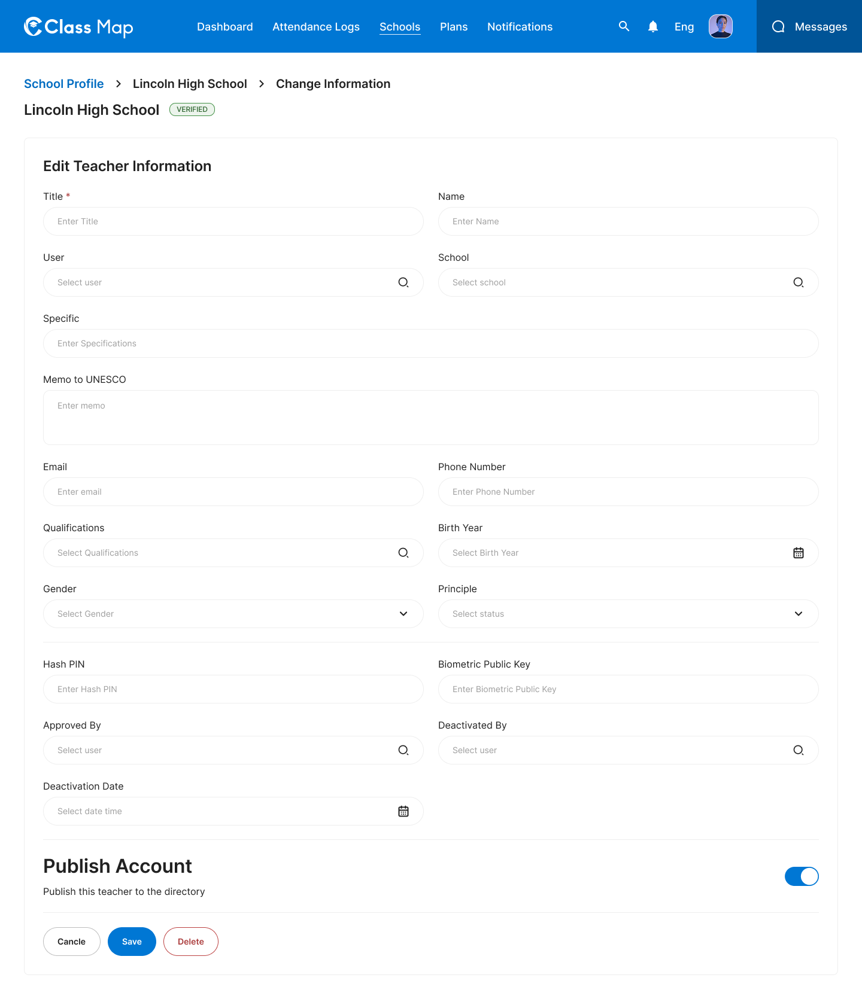
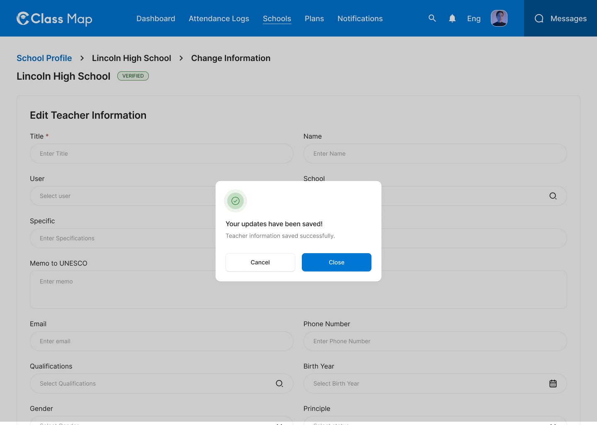

# Teacher Management – Schools





## Flow

```
Admin opens Teachers tab
        |
        v
GET /api/v1/admin/teachers?schoolId={id}          <-- card list of teachers

Admin clicks a teacher card
        |
        v
GET /api/v1/admin/teachers/{id}   <-- teacher detail

        +---> "Approve Teacher" button
        |              |
        |              v
        |     POST /api/v1/admin/teachers/approve  (Approve teacher registration)
        |
        +---> "Change Information" button
        |              |
        |              v
        |     PUT /api/v1/admin/teachers/{id}  (Save)
        |
        +---> "Deactivate Teacher" button
        |              |
        |              v
        |     PATCH /api/v1/admin/schools/{id}/teachers/{teacher_id}/deactivate
        |
        +---> "Cancel Principle" button
                       |
                       v
             PATCH /api/v1/admin/schools/{id}/teachers/{teacher_id}/principle
             { "isPrincipal": false }
```

## Endpoints

- [GET `/api/v1/admin/teachers`](#1-list-teachers) — Teacher list (filterable by school)
- [GET `/api/v1/admin/teachers/{id}`](#2-get-teacher-detail) — Full teacher profile
- [POST `/api/v1/admin/teachers/approve`](#3-approve-teacher) — Approve a teacher registration
- [PUT `/api/v1/admin/teachers/{id}`](#4-update-teacher) — Update teacher information
- [PATCH `/api/v1/admin/schools/{id}/teachers/{teacher_id}/deactivate`](#5-deactivate-teacher) — Deactivate a teacher account
- [PATCH `/api/v1/admin/schools/{id}/teachers/{teacher_id}/principle`](#6-toggle-principal-status) — Set or unset principal role
- [DELETE `/api/v1/admin/teachers/{id}`](#7-delete-teacher) — Permanently remove a teacher

---

### 1. List Teachers

**GET** `/api/v1/admin/teachers`

**Headers**

| Key             | Value                     | Required |
| --------------- | ------------------------- | -------- |
| `Authorization` | `Bearer {{access_token}}` | Yes      |
| `Content-Type`  | `application/json`        | Yes      |
| `X-Request-ID`  | `<uuid>`                  | Yes      |

**Query Parameters**

| Parameter       | Type    | Required | Description                                  |
| --------------- | ------- | -------- | -------------------------------------------- |
| `schoolId`      | string  | No       | Filter by school UUID                        |
| `search`        | string  | No       | Search by name or phone                      |
| `isApproved`    | boolean | No       | Filter by approval status                    |
| `isPrincipal`   | boolean | No       | Filter by principal status                   |
| `includeDrafts` | boolean | No       | Include draft registrations (default: false) |
| `page`          | integer | No       | Page number (default: 1)                     |
| `limit`         | integer | No       | Items per page (default: 10)                 |

**Response – 200 OK**

```json
{
  "success": true,
  "data": [
    {
      "id": "tch_001",
      "name": "Aung Ko Ko",
      "title": "U",
      "phoneNumber": "(+95) 987 654 321",
      "email": "aungkokoko@yahoo.com",
      "isPrincipal": true,
      "isApproved": true,
      "status": true,
      "birthYear": 1985,
      "gender": { "id": "gen_002", "name": "Male" },
      "user": {
        "id": "usr_003",
        "username": "aungkokoko",
        "displayedName": "Aung Ko Ko"
      },
      "createdAt": "2025-06-15T08:00:00Z",
      "updatedAt": "2026-05-01T10:00:00Z"
    },
    {
      "id": "tch_002",
      "name": "Daw Hla Hla",
      "title": "Daw",
      "phoneNumber": "(+95) 123 456 789",
      "email": "dawhlahla@gmail.com",
      "isPrincipal": false,
      "isApproved": true,
      "status": true,
      "birthYear": 1992,
      "gender": { "id": "gen_001", "name": "Female" },
      "user": {
        "id": "usr_002",
        "username": "dawhlahla",
        "displayedName": "Daw Hla Hla"
      },
      "createdAt": "2025-07-31T10:15:00Z",
      "updatedAt": "2026-05-08T10:00:00Z"
    }
  ],
  "meta": {
    "page": 1,
    "limit": 10,
    "total": 66,
    "totalPages": 7
  },
  "error": null,
  "message": "Successfully"
}
```

**Response – 4xx / 5xx**

| Status | Error Code              | Description              |
| ------ | ----------------------- | ------------------------ |
| `401`  | `UNAUTHORIZED`          | Missing or invalid token |
| `403`  | `FORBIDDEN`             | Insufficient role        |
| `429`  | `RATE_LIMIT_EXCEEDED`   | Rate limit exceeded      |
| `500`  | `INTERNAL_SERVER_ERROR` | Unexpected server fault  |

---

### 2. Get Teacher Detail

**GET** `/api/v1/admin/teachers/{id}`

**Headers**

| Key             | Value                     | Required |
| --------------- | ------------------------- | -------- |
| `Authorization` | `Bearer {{access_token}}` | Yes      |
| `Content-Type`  | `application/json`        | Yes      |
| `X-Request-ID`  | `<uuid>`                  | Yes      |

**Path Parameters**

| Parameter | Type   | Required | Description  |
| --------- | ------ | -------- | ------------ |
| `id`      | string | Yes      | Teacher UUID |

**Response – 200 OK**

```json
{
  "success": true,
  "data": {
    "id": "tch_002",
    "name": "Daw Hla Hla",
    "phoneNumber": "xxxxx8118",
    "title": "Daw",
    "email": "dawhlahla@gmail.com",
    "isPrincipal": true,
    "isApproved": true,
    "status": true,
    "birthYear": 1992,
    "memo": null,
    "otherSpecify": null,
    "schoolId": "sch_001",
    "userId": "usr_002",
    "genderId": "gen_001",
    "qualificationId": "qual_001",
    "gender": {
      "id": "gen_001",
      "name": "Female"
    },
    "user": {
      "id": "usr_002",
      "username": "dawhlahla",
      "displayedName": "Daw Hla Hla",
      "avatarUrl": "https://storage.example.com/users/usr_002.jpg"
    },
    "approvedBy": {
      "id": "usr_001",
      "displayedName": "Admin User"
    },
    "deactivatedBy": null,
    "deactivatedOn": null,
    "createdAt": "2025-07-31T10:15:00Z",
    "updatedAt": "2026-05-08T10:00:00Z"
  },
  "meta": null,
  "error": null,
  "message": "Successfully"
}
```

**Response – 4xx / 5xx**

| Status | Error Code              | Description               |
| ------ | ----------------------- | ------------------------- |
| `401`  | `UNAUTHORIZED`          | Missing or invalid token  |
| `403`  | `FORBIDDEN`             | Insufficient role         |
| `404`  | `TEACHER_NOT_FOUND`     | Teacher ID does not exist |
| `429`  | `RATE_LIMIT_EXCEEDED`   | Rate limit exceeded       |
| `500`  | `INTERNAL_SERVER_ERROR` | Unexpected server fault   |

---

### 3. Approve Teacher

**POST** `/api/v1/admin/teachers/approve`

**Headers**

| Key             | Value                     | Required |
| --------------- | ------------------------- | -------- |
| `Authorization` | `Bearer {{access_token}}` | Yes      |
| `Content-Type`  | `application/json`        | Yes      |
| `X-Request-ID`  | `<uuid>`                  | Yes      |

**Request Body**

| Field       | Type    | Required | Description                          |
| ----------- | ------- | -------- | ------------------------------------ |
| `teacherId` | string  | Yes      | Teacher UUID                         |
| `approved`  | boolean | Yes      | `true` to approve, `false` to reject |
| `reason`    | string  | No       | Reason for approval/rejection        |

```json
{
  "teacherId": "tch_002",
  "approved": true,
  "reason": "Documentation verified."
}
```

**Response – 200 OK**

```json
{
  "success": true,
  "data": "Teacher reviewed",
  "meta": null,
  "error": null,
  "message": "Teacher reviewed successfully"
}
```

**Response – 4xx / 5xx**

| Status | Error Code                | Description               |
| ------ | ------------------------- | ------------------------- |
| `400`  | `VALIDATION_ERROR`        | Invalid or missing fields |
| `401`  | `UNAUTHORIZED`            | Missing or invalid token  |
| `403`  | `FORBIDDEN`               | Insufficient role         |
| `404`  | `TEACHER_NOT_FOUND`       | Teacher ID does not exist |
| `422`  | `BUSINESS_RULE_VIOLATION` | Teacher already reviewed  |
| `429`  | `RATE_LIMIT_EXCEEDED`     | Rate limit exceeded       |
| `500`  | `INTERNAL_SERVER_ERROR`   | Unexpected server fault   |

---

### 4. Update Teacher

**PUT** `/api/v1/admin/teachers/{id}`

**Headers**

| Key             | Value                     | Required |
| --------------- | ------------------------- | -------- |
| `Authorization` | `Bearer {{access_token}}` | Yes      |
| `Content-Type`  | `application/json`        | Yes      |
| `X-Request-ID`  | `<uuid>`                  | Yes      |

**Path Parameters**

| Parameter | Type   | Required | Description  |
| --------- | ------ | -------- | ------------ |
| `id`      | string | Yes      | Teacher UUID |

**Request Body**

| Field             | Type          | Required | Description                           |
| ----------------- | ------------- | -------- | ------------------------------------- |
| `title`           | string        | No       | Teacher title (e.g. `U`, `Daw`, `Ko`) |
| `name`            | string        | No       | Full name                             |
| `phoneNumber`     | string        | No       | Phone number                          |
| `email`           | string        | No       | Email address                         |
| `birthYear`       | integer       | No       | Year of birth                         |
| `memo`            | string        | No       | Internal memo                         |
| `otherSpecify`    | string        | No       | Other specification                   |
| `genderId`        | string (UUID) | No       | Gender taxonomy UUID                  |
| `qualificationId` | string (UUID) | No       | Qualification taxonomy UUID           |
| `isPrincipal`     | boolean       | No       | Whether teacher is principal          |

```json
{
  "title": "Daw",
  "name": "Hla Hla",
  "email": "dawhlahla@gmail.com",
  "phoneNumber": "(+95) 123 456 789",
  "birthYear": 1992,
  "genderId": "gen_001",
  "qualificationId": "qual_001",
  "isPrincipal": true
}
```

**Response – 200 OK**

```json
{
  "success": true,
  "data": {
    "id": "tch_002",
    "name": "Daw Hla Hla",
    "phoneNumber": "(+95) 123 456 789",
    "title": "Daw",
    "email": "dawhlahla@gmail.com",
    "isPrincipal": true,
    "isApproved": true,
    "status": true,
    "birthYear": 1992,
    "memo": null,
    "otherSpecify": null,
    "schoolId": "sch_001",
    "userId": "usr_002",
    "genderId": "gen_001",
    "qualificationId": "qual_001",
    "gender": {
      "id": "gen_001",
      "name": "Female"
    },
    "user": {
      "id": "usr_002",
      "username": "dawhlahla",
      "displayedName": "Daw Hla Hla",
      "avatarUrl": "https://storage.example.com/users/usr_002.jpg"
    },
    "approvedBy": {
      "id": "usr_001",
      "displayedName": "Admin User"
    },
    "deactivatedBy": null,
    "deactivatedOn": null,
    "createdAt": "2025-07-31T10:15:00Z",
    "updatedAt": "2026-05-08T10:00:00Z"
  },
  "meta": null,
  "error": null,
  "message": "Teacher updated successfully"
}
```

**Response – 4xx / 5xx**

| Status | Error Code                | Description                        |
| ------ | ------------------------- | ---------------------------------- |
| `400`  | `VALIDATION_ERROR`        | Invalid or missing required fields |
| `401`  | `UNAUTHORIZED`            | Missing or invalid token           |
| `403`  | `FORBIDDEN`               | Insufficient role                  |
| `404`  | `TEACHER_NOT_FOUND`       | Teacher ID does not exist          |
| `409`  | `CONFLICT`                | Concurrent update conflict         |
| `422`  | `BUSINESS_RULE_VIOLATION` | Business rule violation            |
| `429`  | `RATE_LIMIT_EXCEEDED`     | Rate limit exceeded                |
| `500`  | `INTERNAL_SERVER_ERROR`   | Unexpected server fault            |

---

### 5. Deactivate Teacher

**PATCH** `/api/v1/admin/schools/{id}/teachers/{teacher_id}/deactivate`

**Headers**

| Key             | Value                     | Required |
| --------------- | ------------------------- | -------- |
| `Authorization` | `Bearer {{access_token}}` | Yes      |
| `Content-Type`  | `application/json`        | Yes      |
| `X-Request-ID`  | `<uuid>`                  | Yes      |

**Path Parameters**

| Parameter    | Type   | Required | Description  |
| ------------ | ------ | -------- | ------------ |
| `id`         | string | Yes      | School UUID  |
| `teacher_id` | string | Yes      | Teacher UUID |

**Request Body**

| Field    | Type   | Required | Description             |
| -------- | ------ | -------- | ----------------------- |
| `reason` | string | No       | Reason for deactivation |

```json
{
  "reason": "Teacher resigned."
}
```

**Response – 200 OK**

```json
{
  "success": true,
  "data": {
    "id": "tch_002",
    "isApproved": false,
    "status": false,
    "deactivatedOn": "2026-05-08T10:00:00Z",
    "deactivatedBy": {
      "id": "usr_001",
      "displayedName": "Admin User"
    }
  },
  "meta": null,
  "error": null,
  "message": "Teacher account deactivated successfully"
}
```

**Response – 4xx / 5xx**

| Status | Error Code                | Description                 |
| ------ | ------------------------- | --------------------------- |
| `401`  | `UNAUTHORIZED`            | Missing or invalid token    |
| `403`  | `FORBIDDEN`               | Insufficient role           |
| `404`  | `TEACHER_NOT_FOUND`       | Teacher ID does not exist   |
| `422`  | `BUSINESS_RULE_VIOLATION` | Teacher already deactivated |
| `429`  | `RATE_LIMIT_EXCEEDED`     | Rate limit exceeded         |
| `500`  | `INTERNAL_SERVER_ERROR`   | Unexpected server fault     |

---

### 6. Toggle Principal Status

**PATCH** `/api/v1/admin/schools/{id}/teachers/{teacher_id}/principle`

**Headers**

| Key             | Value                     | Required |
| --------------- | ------------------------- | -------- |
| `Authorization` | `Bearer {{access_token}}` | Yes      |
| `Content-Type`  | `application/json`        | Yes      |
| `X-Request-ID`  | `<uuid>`                  | Yes      |

**Path Parameters**

| Parameter    | Type   | Required | Description  |
| ------------ | ------ | -------- | ------------ |
| `id`         | string | Yes      | School UUID  |
| `teacher_id` | string | Yes      | Teacher UUID |

**Request Body**

| Field         | Type    | Required | Description                                        |
| ------------- | ------- | -------- | -------------------------------------------------- |
| `isPrincipal` | boolean | Yes      | `true` to assign, `false` to remove principal role |

```json
{
  "isPrincipal": false
}
```

**Response – 200 OK**

```json
{
  "success": true,
  "data": {
    "id": "tch_002",
    "isPrincipal": false,
    "updatedAt": "2026-05-08T10:00:00Z"
  },
  "meta": null,
  "error": null,
  "message": "Principal status updated successfully"
}
```

**Response – 4xx / 5xx**

| Status | Error Code                | Description                                            |
| ------ | ------------------------- | ------------------------------------------------------ |
| `400`  | `VALIDATION_ERROR`        | Missing `isPrincipal` field                            |
| `401`  | `UNAUTHORIZED`            | Missing or invalid token                               |
| `403`  | `FORBIDDEN`               | Insufficient role                                      |
| `404`  | `TEACHER_NOT_FOUND`       | Teacher ID does not exist                              |
| `422`  | `BUSINESS_RULE_VIOLATION` | Cannot remove sole principal without assigning another |
| `429`  | `RATE_LIMIT_EXCEEDED`     | Rate limit exceeded                                    |
| `500`  | `INTERNAL_SERVER_ERROR`   | Unexpected server fault                                |

---

### 7. Delete Teacher

**DELETE** `/api/v1/admin/teachers/{id}`

**Headers**

| Key             | Value                     | Required |
| --------------- | ------------------------- | -------- |
| `Authorization` | `Bearer {{access_token}}` | Yes      |
| `X-Request-ID`  | `<uuid>`                  | Yes      |

**Path Parameters**

| Parameter | Type   | Required | Description  |
| --------- | ------ | -------- | ------------ |
| `id`      | string | Yes      | Teacher UUID |

**Response – 204 No Content**

No body returned.

**Response – 4xx / 5xx**

| Status | Error Code                | Description                    |
| ------ | ------------------------- | ------------------------------ |
| `401`  | `UNAUTHORIZED`            | Missing or invalid token       |
| `403`  | `FORBIDDEN`               | Insufficient role              |
| `404`  | `TEACHER_NOT_FOUND`       | Teacher ID does not exist      |
| `422`  | `BUSINESS_RULE_VIOLATION` | Cannot delete active principal |
| `429`  | `RATE_LIMIT_EXCEEDED`     | Rate limit exceeded            |
| `500`  | `INTERNAL_SERVER_ERROR`   | Unexpected server fault        |

## Error Codes

| Code                      | HTTP Status | Description                |
| ------------------------- | ----------- | -------------------------- |
| `VALIDATION_ERROR`        | 400         | Invalid or missing fields  |
| `UNAUTHORIZED`            | 401         | Missing or invalid token   |
| `FORBIDDEN`               | 403         | Insufficient role          |
| `SCHOOL_NOT_FOUND`        | 404         | School not found           |
| `TEACHER_NOT_FOUND`       | 404         | Teacher not found          |
| `CONFLICT`                | 409         | Concurrent update conflict |
| `BUSINESS_RULE_VIOLATION` | 422         | Business rule failed       |
| `RATE_LIMIT_EXCEEDED`     | 429         | Too many requests          |
| `INTERNAL_SERVER_ERROR`   | 500         | Unexpected server error    |
