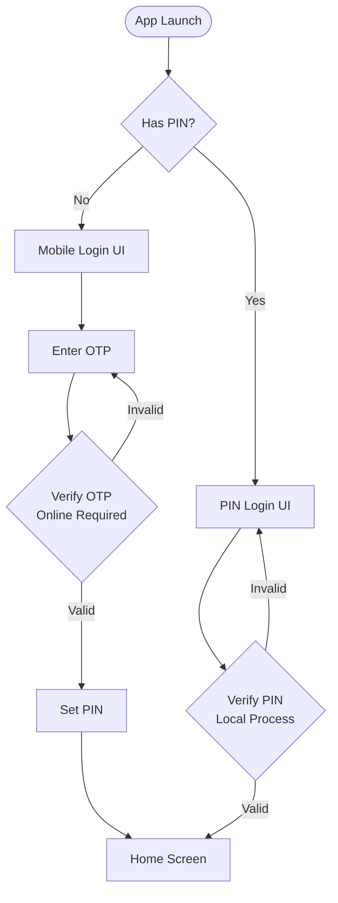

# Class Map Mobile – API Documentation

**Class Map Mobile** is the Android & iOS app for school principals and teachers. It supports OTP-based authentication, school registration, and teacher registration.

---

## Available APIs

| Module | Endpoints | Description |
|---|---|---|
| [Login & Authentication](login.md) | 3 | Phone OTP login, PIN setup, biometric |
| [School Registration](school-register.md) | 11 | Multi-step wizard: school info, documents, admin account, submit |
| [Teacher Registration](teacher-register.md) | 5 | School code lookup, account info, OTP verification, submit |

**Total: 19 endpoints**

---

## Login Flow

---

## Postman Collection

Import `classmap-mobile.postman_collection.json` from the repo root and set these variables after import:

| Variable | Description |
|---|---|
| `base_url` | API base URL (e.g. `http://localhost:8080`) |
| `access_token` | JWT access token from login |
| `refresh_token` | Refresh token from login |
| `temp_token` | Temporary token from OTP verify (new users) |
| `school_registration_id` | Draft school registration ID |
| `teacher_registration_id` | Draft teacher registration ID |
| `school_id` | Target school UUID |
| `school_code` | School register code (e.g. `SCH001`) |
