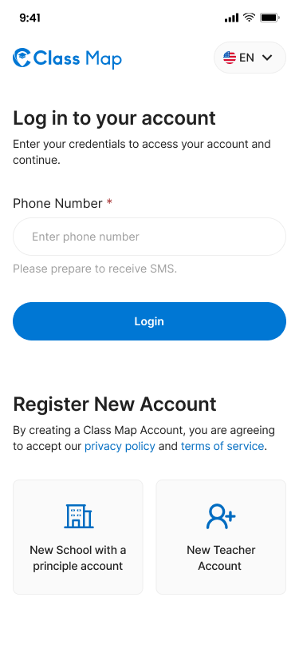
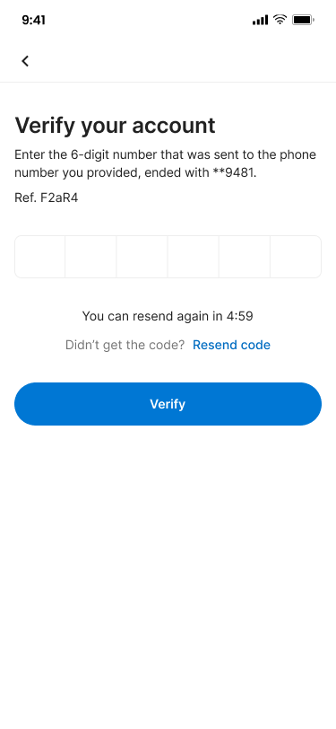
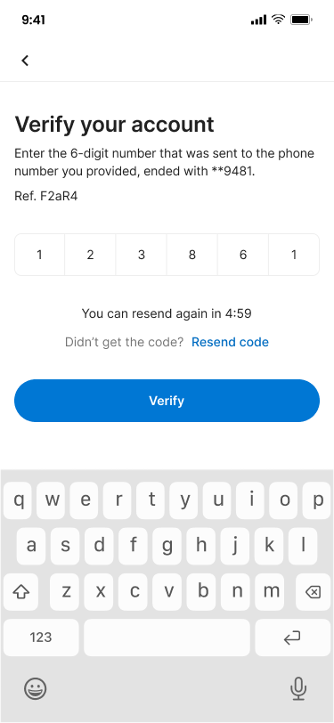
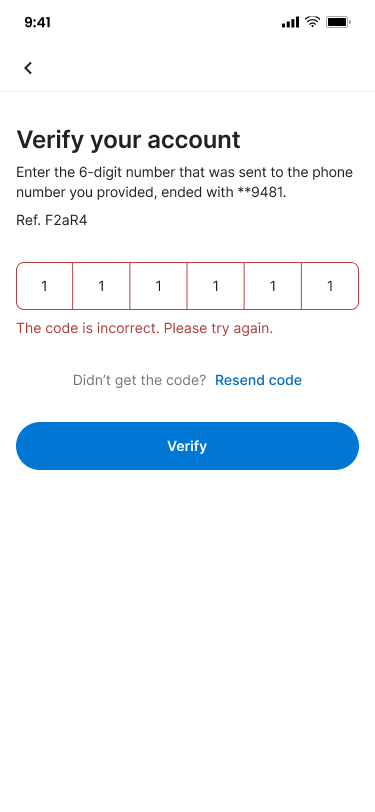
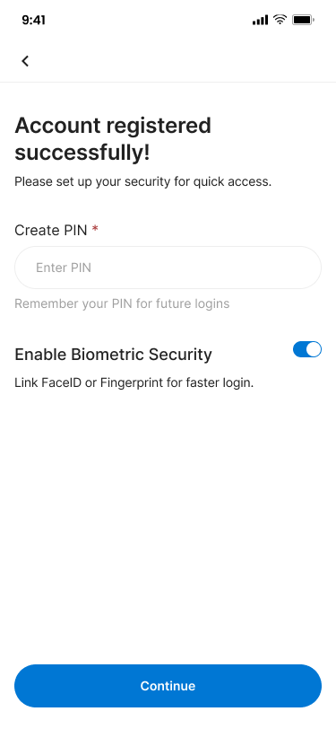

# Login & Authentication – Login







## Flow

```
┌─────────────┐     ┌──────────────────┐     ┌─────────────────┐     ┌─────────────┐     ┌──────┐
│ Enter Phone │────▶│ Request OTP      │────▶│ Enter OTP       │────▶│ Verify OTP  │────▶│ Home │
│             │     │ (SMS)            │     │ (6-digit)       │     │ (Online)    │     │      │
└─────────────┘     └──────────────────┘     └─────────────────┘     └──────┬──────┘     └──────┘
                                                                            │
                                                       New user ◀───────────┘
                                                                            │
                                                       ┌──────────────┐     │
                                                       │ Setup PIN    │─────┘
                                                       │ + Biometric  │
                                                       └──────────────┘
```

## Endpoints

- [POST `/api/v1/mobile/auth/otp/request`](#1-request-otp) — Send OTP to phone number
- [POST `/api/v1/mobile/auth/otp/verify`](#2-verify-otp) — Verify 6-digit OTP code
- [POST `/api/v1/mobile/auth/pin/setup`](#3-setup-pin) — Create PIN and biometric preference
- [POST `/api/v1/mobile/auth/refresh`](#4-refresh-token) — Exchange refresh token for new access token
- [GET `/api/v1/mobile/auth/me`](#5-get-current-user) — Get current user and teacher profile
- [POST `/api/v1/mobile/auth/sign-out`](#6-sign-out) — Revoke current session
- [DELETE `/api/v1/mobile/auth/pin`](#7-reset-pin) — Reset PIN for current user

---

### 1. Request OTP

**POST** `/api/v1/mobile/auth/otp/request`

Send a 6-digit OTP via SMS to the provided phone number.

**Headers**

| Header       | Value            | Required |
| ------------ | ---------------- | -------- |
| Content-Type | application/json | Yes      |
| X-Request-ID | {{$guid}}        | Yes      |

**Request Body**

| Field       | Type   | Required | Description                      |
| ----------- | ------ | -------- | -------------------------------- |
| phoneNumber | string | Yes      | E.164 format, e.g. +959123456789 |

```json
{
  "phoneNumber": "+959123456789"
}
```

**Response – 200 OK**

```json
{
  "success": true,
  "data": {
    "referenceCode": "F2aR4",
    "expireIn": 600,
    "retryAfter": 60
  },
  "meta": null,
  "error": null,
  "message": "OTP sent successfully"
}
```

**Response – 400 Bad Request**

```json
{
  "success": false,
  "data": null,
  "meta": null,
  "error": {
    "code": "INVALID_PHONE_NUMBER",
    "details": "Phone number must be in E.164 format"
  },
  "message": "Invalid phone number"
}
```

**Response – 429 Too Many Requests**

```json
{
  "success": false,
  "data": null,
  "meta": null,
  "error": {
    "code": "OTP_RATE_LIMIT",
    "details": "Please wait 4:59 before requesting a new code"
  },
  "message": "Too many OTP requests"
}
```

---

### 2. Verify OTP

**POST** `/api/v1/mobile/auth/otp/verify`

Verify the 6-digit OTP code. Returns tokens for existing users or a temporary token for new users who need to set up PIN.

**Headers**

| Header       | Value            | Required |
| ------------ | ---------------- | -------- |
| Content-Type | application/json | Yes      |
| X-Request-ID | {{$guid}}        | Yes      |

**Request Body**

| Field         | Type   | Required | Description                              |
| ------------- | ------ | -------- | ---------------------------------------- |
| phoneNumber   | string | Yes      | Same phone used to request OTP           |
| otp           | string | Yes      | 6-digit code from SMS                    |
| referenceCode | string | Yes      | Reference code from OTP request response |

```json
{
  "phoneNumber": "+959123456789",
  "otp": "123861",
  "referenceCode": "F2aR4"
}
```

**Response – 200 OK (Existing User)**

```json
{
  "success": true,
  "data": {
    "accessToken": "eyJhbGciOiJIUzI1NiIs...",
    "refreshToken": "eyJhbGciOiJIUzI1NiIs...",
    "accessTokenExpiresAt": 1715601600,
    "refreshTokenExpiresAt": 1716206400,
    "requirePinSetup": false,
    "user": {
      "id": "usr_001",
      "username": "teacher001",
      "displayedName": "U Aung Kyaw",
      "phoneNumber": "+959123456789",
      "email": "aung@example.com",
      "status": true,
      "roles": ["teacher"]
    },
    "teacher": {
      "id": "tch_001",
      "name": "U Aung Kyaw",
      "schoolId": "sch_001",
      "isPrincipal": false
    }
  },
  "meta": null,
  "error": null,
  "message": "Login successful"
}
```

**Response – 200 OK (New User)**

```json
{
  "success": true,
  "data": {
    "accessToken": "eyJhbGciOiJIUzI1NiIs...",
    "refreshToken": "eyJhbGciOiJIUzI1NiIs...",
    "accessTokenExpiresAt": 1715601600,
    "refreshTokenExpiresAt": 1716206400,
    "requirePinSetup": true,
    "user": {
      "id": "usr_002",
      "username": "teacher002",
      "displayedName": "Daw Mya Mya",
      "phoneNumber": "+959123456789",
      "email": null,
      "status": true,
      "roles": ["teacher"]
    },
    "teacher": null
  },
  "meta": null,
  "error": null,
  "message": "Phone verified. Please set up your PIN."
}
```

**Response – 400 Bad Request**

```json
{
  "success": false,
  "data": null,
  "meta": null,
  "error": {
    "code": "INVALID_OTP",
    "details": "The code is incorrect. Please try again."
  },
  "message": "Invalid OTP"
}
```

**Response – 401 Unauthorized**

```json
{
  "success": false,
  "data": null,
  "meta": null,
  "error": {
    "code": "OTP_EXPIRED",
    "details": "OTP has expired. Please request a new one."
  },
  "message": "OTP expired"
}
```

---

### 3. Setup PIN

**POST** `/api/v1/mobile/auth/pin/setup`

Create a 4-6 digit PIN and optionally enable biometric security. Only callable with a valid `temp_token` from OTP verify for new users.

**Headers**

| Header        | Value               | Required |
| ------------- | ------------------- | -------- |
| Content-Type  | application/json    | Yes      |
| Authorization | Bearer {temp_token} | Yes      |
| X-Request-ID  | {{$guid}}           | Yes      |

**Request Body**

| Field              | Type   | Required | Description                                   |
| ------------------ | ------ | -------- | --------------------------------------------- |
| pin                | string | Yes      | Exactly 4-digit numeric PIN                   |
| biometricPublicKey | string | No       | Public key for FaceID / Fingerprint biometric |

```json
{
  "pin": "1234",
  "biometricPublicKey": "MIIBIjANBgkqhkiG9w0BAQEFAAOCAQ8A..."
}
```

**Response – 200 OK**

```json
{
  "success": true,
  "data": {
    "hashPin": "$2b$10$...",
    "biometricPublicKey": "MIIBIjANBgkqhkiG9w0BAQEFAAOCAQ8A..."
  },
  "meta": null,
  "error": null,
  "message": "PIN created successfully"
}
```

**Response – 400 Bad Request**

```json
{
  "success": false,
  "data": null,
  "meta": null,
  "error": {
    "code": "INVALID_PIN",
    "details": "PIN must be 4-6 digits"
  },
  "message": "Invalid PIN format"
}
```

**Response – 401 Unauthorized**

````json
{
  "success": false,
  "data": null,
  "meta": null,
  "error": {
    "code": "INVALID_TEMP_TOKEN",
    "details": "Temp token expired or invalid"
  },
  "message": "Unauthorized"
}
---

### 4. Refresh Token
**POST** `/api/v1/mobile/auth/refresh`

Exchange a valid refresh token for a new access token pair.

**Headers**

| Header | Value | Required |
|---|---|---|
| Content-Type | application/json | Yes |
| X-Request-ID | {{$guid}} | Yes |

**Request Body**

| Field        | Type   | Required | Description                              |
| ------------ | ------ | -------- | ---------------------------------------- |
| refreshToken | string | Yes      | Refresh token from login or PIN setup    |

```json
{
  "refreshToken": "eyJhbGciOiJIUzI1NiIs..."
}
````

**Response – 200 OK**

```json
{
  "success": true,
  "data": {
    "accessToken": "eyJhbGciOiJIUzI1NiIs...(new)",
    "refreshToken": "eyJhbGciOiJIUzI1NiIs...(new)",
    "accessTokenExpiresAt": 1715601600,
    "refreshTokenExpiresAt": 1716206400,
    "requirePinSetup": false,
    "user": {
      "id": "usr_001",
      "username": "teacher001",
      "displayedName": "U Aung Kyaw",
      "phoneNumber": "+959123456789",
      "email": "aung@example.com",
      "status": true,
      "roles": ["teacher"]
    },
    "teacher": {
      "id": "tch_001",
      "name": "U Aung Kyaw",
      "schoolId": "sch_001",
      "isPrincipal": false
    }
  },
  "meta": null,
  "error": null,
  "message": "Token refreshed successfully"
}
```

**Response – 401 Unauthorized**

```json
{
  "success": false,
  "data": null,
  "meta": null,
  "error": {
    "code": "UNAUTHORIZED",
    "details": "Refresh token is invalid or has expired"
  },
  "message": "Unauthorized"
}
```

---

### 5. Get Current User

**GET** `/api/v1/mobile/auth/me`

Retrieve the current authenticated user and linked teacher profile.

**Headers**

| Header        | Value                 | Required |
| ------------- | --------------------- | -------- |
| Authorization | Bearer {access_token} | Yes      |
| Content-Type  | application/json      | Yes      |
| X-Request-ID  | {{$guid}}             | Yes      |

**Response – 200 OK**

```json
{
  "success": true,
  "data": {
    "user": {
      "id": "usr_001",
      "username": "teacher001",
      "displayedName": "U Aung Kyaw",
      "phoneNumber": "+959123456789",
      "email": "aung@example.com",
      "status": true,
      "roles": ["teacher"]
    },
    "teacher": {
      "id": "tch_001",
      "name": "U Aung Kyaw",
      "schoolId": "sch_001",
      "isPrincipal": false
    }
  },
  "meta": null,
  "error": null,
  "message": "User fetched successfully"
}
```

**Response – 401 Unauthorized**

```json
{
  "success": false,
  "data": null,
  "meta": null,
  "error": {
    "code": "UNAUTHORIZED",
    "details": "Invalid or missing access token"
  },
  "message": "Unauthorized"
}
```

---

### 6. Sign Out

**POST** `/api/v1/mobile/auth/sign-out`

Revoke the current session and invalidate the refresh token.

**Headers**

| Header        | Value                 | Required |
| ------------- | --------------------- | -------- |
| Authorization | Bearer {access_token} | Yes      |
| Content-Type  | application/json      | Yes      |
| X-Request-ID  | {{$guid}}             | Yes      |

**Response – 200 OK**

```json
{
  "success": true,
  "data": null,
  "meta": null,
  "error": null,
  "message": "Signed out successfully"
}
```

**Response – 401 Unauthorized**

```json
{
  "success": false,
  "data": null,
  "meta": null,
  "error": {
    "code": "UNAUTHORIZED",
    "details": "Invalid or missing access token"
  },
  "message": "Unauthorized"
}
```

---

### 7. Reset PIN

**DELETE** `/api/v1/mobile/auth/pin`

Remove the stored PIN and biometric key for the current user. The user must verify OTP again to set a new PIN.

**Headers**

| Header        | Value                 | Required |
| ------------- | --------------------- | -------- |
| Authorization | Bearer {access_token} | Yes      |
| Content-Type  | application/json      | Yes      |
| X-Request-ID  | {{$guid}}             | Yes      |

**Response – 200 OK**

```json
{
  "success": true,
  "data": "PIN reset successfully",
  "meta": null,
  "error": null,
  "message": "PIN reset successfully"
}
```

**Response – 401 Unauthorized**

```json
{
  "success": false,
  "data": null,
  "meta": null,
  "error": {
    "code": "UNAUTHORIZED",
    "details": "Invalid or missing access token"
  },
  "message": "Unauthorized"
}
```

---

## Error Codes

| Code                 | HTTP Status | Description                      |
| -------------------- | ----------- | -------------------------------- |
| INVALID_PHONE_NUMBER | 400         | Phone number not in E.164 format |
| OTP_RATE_LIMIT       | 429         | Too many OTP requests            |
| INVALID_OTP          | 400         | Incorrect OTP code               |
| OTP_EXPIRED          | 401         | OTP code has expired             |
| INVALID_TEMP_TOKEN   | 401         | Temp token missing or expired    |
| INVALID_PIN          | 400         | PIN must be 4-6 digits           |
