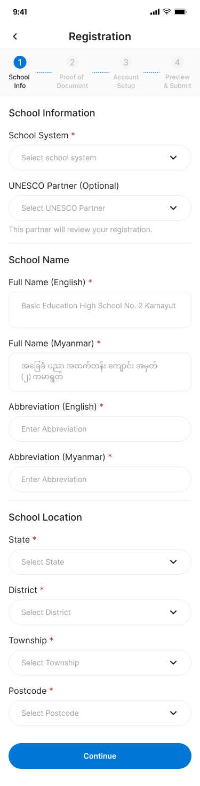
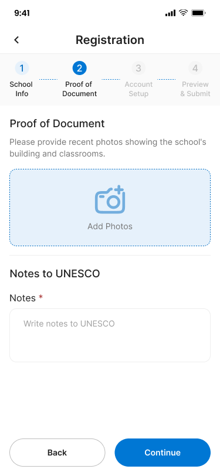
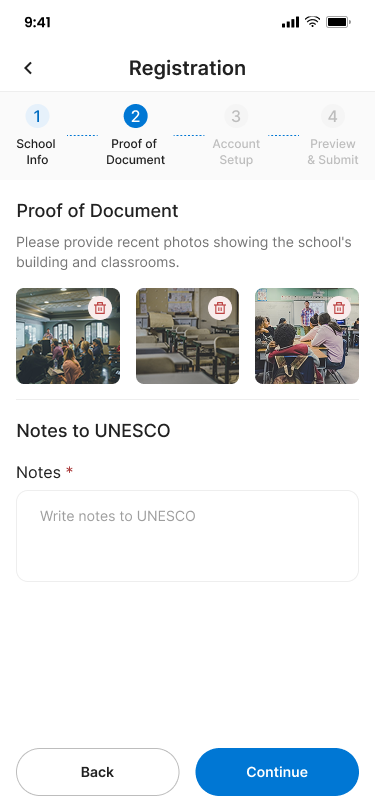
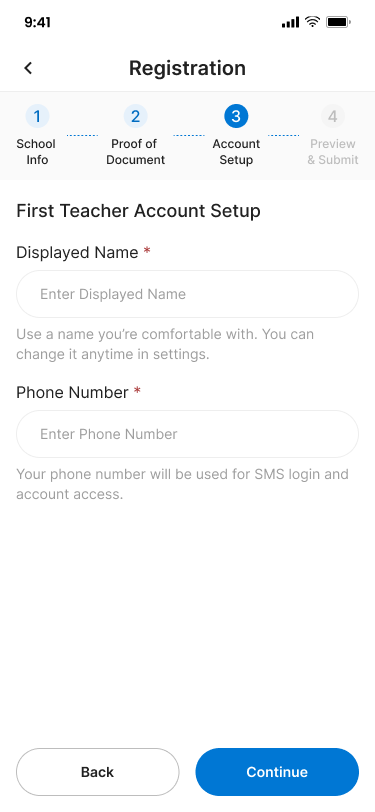
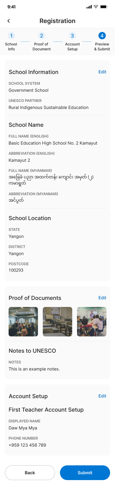
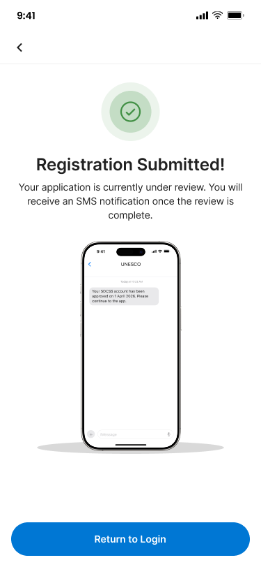

# School Registration – School Register








## Flow

```
┌──────────────┐     ┌──────────────┐     ┌──────────────────┐     ┌──────────────────┐     ┌─────────┐
│ School Info  │────▶│ Proof of     │────▶│ First Teacher    │────▶│ Preview &        │────▶│ Pending │
│ (Step 1)     │     │ Document     │     │ Account Setup    │     │ Submit (Step 4)  │     │ Review  │
│              │     │ (Step 2)     │     │ (Step 3)         │     │                  │     │         │
└──────────────┘     └──────────────┘     └──────────────────┘     └──────────────────┘     └─────────┘
```

## Endpoints

- [GET `/api/v1/mobile/taxonomy/school-systems`](#1-list-school-systems) — List available school systems
- [GET `/api/v1/mobile/user/unesco-partners`](#2-list-unesco-partners) — List UNESCO partners
- [GET `/api/v1/mobile/taxonomy/states`](#3-list-states) — List states
- [GET `/api/v1/mobile/taxonomy/districts`](#4-list-districts) — List districts by state
- [GET `/api/v1/mobile/taxonomy/townships`](#5-list-townships) — List townships by district
- [GET `/api/v1/mobile/locations/postcodes`](#6-list-postcodes) — List postcodes by township (not yet implemented)
- [POST `/api/v1/mobile/school-registrations/draft`](#7-create-school-registration) — Step 1: Submit school info
- [PUT `/api/v1/mobile/school-registrations/{id}/documents`](#8-upload-documents) — Step 2: Upload proof documents
- [PUT `/api/v1/mobile/school-registrations/{id}/admin-account`](#9-setup-admin-account) — Step 3: Setup first teacher account
- [POST `/api/v1/mobile/school-registrations/{id}/otp/request`](#9a-request-otp-for-admin-phone) — Request OTP for admin phone
- [POST `/api/v1/mobile/school-registrations/{id}/otp/verify`](#9b-verify-admin-phone-otp) — Verify admin phone OTP
- [GET `/api/v1/mobile/school-registrations/{id}`](#10-get-registration-preview) — Step 4: Preview all data
- [POST `/api/v1/mobile/school-registrations/{id}/submit`](#11-submit-registration) — Final submission for review

---

### 1. List School Systems

**GET** `/api/v1/mobile/taxonomy/school-systems`

Fetch all available school systems for the dropdown.

**Headers**

| Header       | Value            | Required |
| ------------ | ---------------- | -------- |
| Content-Type | application/json | Yes      |
| X-Request-ID | {{$guid}}        | Yes      |

**Response – 200 OK**

```json
{
  "success": true,
  "data": [
    { "id": "gov", "name": "Government School" },
    { "id": "private", "name": "Private School" },
    { "id": "international", "name": "International School" }
  ],
  "meta": null,
  "error": null,
  "message": "School systems retrieved"
}
```

---

### 2. List UNESCO Partners

**GET** `/api/v1/mobile/user/unesco-partners`

Fetch all UNESCO partners for the optional dropdown.

**Headers**

| Header       | Value            | Required |
| ------------ | ---------------- | -------- |
| Content-Type | application/json | Yes      |
| X-Request-ID | {{$guid}}        | Yes      |

**Response – 200 OK**

```json
{
  "success": true,
  "data": [
    {
      "id": "usr_rise",
      "displayedName": "Rural Indigenous Sustainable Education"
    },
    { "id": "usr_unesco", "displayedName": "UNESCO Myanmar" }
  ],
  "meta": null,
  "error": null,
  "message": "UNESCO partners retrieved"
}
```

---

### 3. List States

**GET** `/api/v1/mobile/taxonomy/states`

Fetch all states for the location dropdown.

**Headers**

| Header       | Value            | Required |
| ------------ | ---------------- | -------- |
| Content-Type | application/json | Yes      |
| X-Request-ID | {{$guid}}        | Yes      |

**Response – 200 OK**

```json
{
  "success": true,
  "data": [
    { "id": "ygn", "name": "Yangon" },
    { "id": "mdy", "name": "Mandalay" }
  ],
  "meta": null,
  "error": null,
  "message": "States retrieved"
}
```

---

### 4. List Districts

**GET** `/api/v1/mobile/taxonomy/districts?stateId={stateId}`

Fetch districts filtered by state.

**Query Parameters**

| Parameter | Type   | Required | Description               |
| --------- | ------ | -------- | ------------------------- |
| stateId   | string | Yes      | State ID from list states |

**Response – 200 OK**

```json
{
  "success": true,
  "data": [{ "id": "ygn_01", "name": "Yangon", "state_id": "ygn" }],
  "meta": null,
  "error": null,
  "message": "Districts retrieved"
}
```

---

### 5. List Townships

**GET** `/api/v1/mobile/taxonomy/townships?districtId={districtId}`

Fetch townships filtered by district.

**Query Parameters**

| Parameter  | Type   | Required | Description                     |
| ---------- | ------ | -------- | ------------------------------- |
| districtId | string | Yes      | District ID from list districts |

**Response – 200 OK**

```json
{
  "success": true,
  "data": [{ "id": "kamayut", "name": "Kamayut", "district_id": "ygn_01" }],
  "meta": null,
  "error": null,
  "message": "Townships retrieved"
}
```

---

### 6. List Postcodes

**GET** `/api/v1/mobile/locations/postcodes?townshipId={townshipId}`

> **Note**: This endpoint is not yet implemented in the backend. Listed here for future reference.

Fetch postcodes filtered by township.

**Query Parameters**

| Parameter  | Type   | Required | Description                     |
| ---------- | ------ | -------- | ------------------------------- |
| townshipId | string | Yes      | Township ID from list townships |

**Response – 200 OK**

```json
{
  "success": true,
  "data": [{ "id": "100293", "code": "100293", "townshipId": "kamayut" }],
  "meta": null,
  "error": null,
  "message": "Postcodes retrieved"
}
```

---

### 7. Create School Registration

**POST** `/api/v1/mobile/school-registrations/draft`

Step 1: Submit school information and create a registration draft.

**Headers**

| Header       | Value            | Required |
| ------------ | ---------------- | -------- |
| Content-Type | application/json | Yes      |
| X-Request-ID | {{$guid}}        | Yes      |

**Request Body**

| Field          | Type   | Required | Description                     |
| -------------- | ------ | -------- | ------------------------------- |
| schoolSystemId | string | Yes      | Selected school system ID       |
| partnerUserId  | string | No       | Selected UNESCO partner user ID |
| nameEn         | string | Yes      | School full name in English     |
| nameMm         | string | No       | School full name in Myanmar     |
| abbreviationEn | string | No       | Abbreviation in English         |
| abbreviationMm | string | No       | Abbreviation in Myanmar         |
| stateId        | string | Yes      | State ID                        |
| districtId     | string | Yes      | District ID                     |
| townshipId     | string | Yes      | Township ID                     |
| postcode       | string | No       | Postal code (e.g. `100293`)     |
| address1       | string | No       | Street address                  |
| memo           | string | No       | Additional notes                |

```json
{
  "schoolSystemId": "gov",
  "partnerUserId": "rise",
  "nameEn": "Basic Education High School No. 2 Kamayut",
  "nameMm": "အခြေခံပညာအထက်တန်းကျောင်း (၂) ကမာရွတ်",
  "abbreviationEn": "Kamayut 2",
  "abbreviationMm": "ကမာရွတ်(၂)",
  "stateId": "ygn",
  "districtId": "ygn_01",
  "townshipId": "kamayut",
  "postcode": "100293",
  "address1": "123 Kamayut Road",
  "memo": "New school application"
}
```

**Response – 201 Created**

```json
{
  "success": true,
  "data": {
    "id": "sch_reg_001",
    "currentStep": "school_info",
    "referenceCode": "F2aR4",
    "retryAfter": 60,
    "expireIn": 600
  },
  "meta": null,
  "error": null,
  "message": "Draft created"
}
```

**Response – 400 Bad Request**

```json
{
  "success": false,
  "data": null,
  "meta": null,
  "error": {
    "code": "VALIDATION_ERROR",
    "details": { "nameEn": "This field is required" }
  },
  "message": "Validation failed"
}
```

---

### 8. Upload Documents

**PUT** `/api/v1/mobile/school-registrations/{id}/documents`

Step 2: Upload proof of document photos and notes. Uses `multipart/form-data`.

**Headers**

| Header       | Value               | Required |
| ------------ | ------------------- | -------- |
| Content-Type | multipart/form-data | Yes      |
| X-Request-ID | {{$guid}}           | Yes      |

**Path Variables**

| Variable | Description                        |
| -------- | ---------------------------------- |
| id       | School registration ID from step 1 |

**Request Body (multipart)**

| Field | Type   | Required | Description                            |
| ----- | ------ | -------- | -------------------------------------- |
| files | file[] | Yes      | JPEG/PNG, max 5MB each, up to 10 files |

**Response – 200 OK**

```json
{
  "success": true,
  "data": {
    "id": "sch_reg_001",
    "currentStep": "upload_documents"
  },
  "meta": null,
  "error": null,
  "message": "Documents uploaded"
}
```

**Response – 400 Bad Request**

```json
{
  "success": false,
  "data": null,
  "meta": null,
  "error": {
    "code": "INVALID_FILE",
    "details": "Photos must be JPEG or PNG, max 5MB each"
  },
  "message": "Invalid file format"
}
```

**Response – 404 Not Found**

```json
{
  "success": false,
  "data": null,
  "meta": null,
  "error": {
    "code": "REGISTRATION_NOT_FOUND",
    "details": "School registration not found"
  },
  "message": "Registration not found"
}
```

---

### 9. Setup Admin Account

**PUT** `/api/v1/mobile/school-registrations/{id}/admin-account`

Step 3: Create the first teacher/admin account for the school.

**Headers**

| Header       | Value            | Required |
| ------------ | ---------------- | -------- |
| Content-Type | application/json | Yes      |
| X-Request-ID | {{$guid}}        | Yes      |

**Path Variables**

| Variable | Description            |
| -------- | ---------------------- |
| id       | School registration ID |

**Request Body**

| Field       | Type   | Required | Description                   |
| ----------- | ------ | -------- | ----------------------------- |
| displayName | string | Yes      | Name shown in the app         |
| phoneNumber | string | Yes      | E.164 format for SMS login    |
| email       | string | No       | Email address                 |
| langCode    | string | No       | Language code (default: `en`) |

```json
{
  "displayName": "Daw Mya Mya",
  "phoneNumber": "+959123456789",
  "email": "dawmya@example.com",
  "langCode": "en"
}
```

**Response – 200 OK**

```json
{
  "success": true,
  "data": {
    "id": "sch_reg_001",
    "currentStep": "admin_account",
    "adminAccount": {
      "displayName": "Daw Mya Mya",
      "phoneNumber": "+959123456789",
      "email": "dawmya@example.com",
      "langCode": "en"
    }
  },
  "meta": null,
  "error": null,
  "message": "Admin account configured"
}
```

**Response – 409 Conflict**

```json
{
  "success": false,
  "data": null,
  "meta": null,
  "error": {
    "code": "PHONE_ALREADY_USED",
    "details": "This phone number is already associated with another account"
  },
  "message": "Phone number already in use"
}
```

---

### 9a. Request OTP for Admin Phone

**POST** `/api/v1/mobile/school-registrations/{id}/otp/request`

Request an OTP to verify the admin phone number.

**Headers**

| Header       | Value            | Required |
| ------------ | ---------------- | -------- |
| Content-Type | application/json | Yes      |
| X-Request-ID | {{$guid}}        | Yes      |

**Path Variables**

| Variable | Description            |
| -------- | ---------------------- |
| id       | School registration ID |

**Response – 200 OK**

```json
{
  "success": true,
  "data": {
    "id": "sch_reg_001",
    "currentStep": "request_otp",
    "referenceCode": "F2aR4",
    "retryAfter": 60,
    "expireIn": 600
  },
  "meta": null,
  "error": null,
  "message": "OTP sent"
}
```

**Response – 429 Too Many Requests**

```json
{
  "success": false,
  "data": null,
  "meta": null,
  "error": {
    "code": "OTP_RATE_LIMIT",
    "details": "Please wait before requesting a new code"
  },
  "message": "Too many OTP requests"
}
```

---

### 9b. Verify Admin Phone OTP

**POST** `/api/v1/mobile/school-registrations/{id}/otp/verify`

Verify the 6-digit OTP for the admin phone.

**Headers**

| Header       | Value            | Required |
| ------------ | ---------------- | -------- |
| Content-Type | application/json | Yes      |
| X-Request-ID | {{$guid}}        | Yes      |

**Path Variables**

| Variable | Description            |
| -------- | ---------------------- |
| id       | School registration ID |

**Request Body**

| Field         | Type   | Required | Description                     |
| ------------- | ------ | -------- | ------------------------------- |
| otp           | string | Yes      | 6-digit code from SMS           |
| referenceCode | string | Yes      | Reference code from OTP request |

```json
{
  "otp": "123861",
  "referenceCode": "F2aR4"
}
```

**Response – 200 OK**

```json
{
  "success": true,
  "data": {
    "id": "sch_reg_001",
    "currentStep": "verify_otp"
  },
  "meta": null,
  "error": null,
  "message": "OTP verified"
}
```

**Response – 400 Bad Request**

```json
{
  "success": false,
  "data": null,
  "meta": null,
  "error": {
    "code": "INVALID_OTP",
    "details": "The code is incorrect. Please try again."
  },
  "message": "Invalid OTP"
}
```

---

### 10. Get Registration Preview

**GET** `/api/v1/mobile/school-registrations/{id}`

Step 4: Retrieve the full registration data for preview before submission.

**Headers**

| Header       | Value            | Required |
| ------------ | ---------------- | -------- |
| Content-Type | application/json | Yes      |
| X-Request-ID | {{$guid}}        | Yes      |

**Path Variables**

| Variable | Description            |
| -------- | ---------------------- |
| id       | School registration ID |

**Response – 200 OK**

```json
{
  "success": true,
  "data": {
    "id": "sch_reg_001",
    "currentStep": "preview",
    "schoolInfo": {
      "schoolSystem": { "id": "gov", "name": "Government School" },
      "partnerUser": {
        "id": "rise",
        "displayName": "Rural Indigenous Sustainable Education"
      },
      "nameEn": "Basic Education High School No. 2 Kamayut",
      "nameMm": "အခြေခံပညာအထက်တန်းကျောင်း (၂) ကမာရွတ်",
      "abbreviationEn": "Kamayut 2",
      "abbreviationMm": "ကမာရွတ်(၂)",
      "state": { "id": "ygn", "name": "Yangon" },
      "district": { "id": "ygn_01", "name": "Yangon" },
      "township": { "id": "kamayut", "name": "Kamayut" },
      "postcode": "100293",
      "address1": "123 Kamayut Road",
      "phoneNumber": "+951234567",
      "email": "school@example.com",
      "memo": "New school application"
    },
    "documents": {
      "photos": [{ "id": "doc_1", "url": "https://cdn.example.com/doc_1.jpg" }],
      "notes": "This is an example notes."
    },
    "adminAccount": {
      "displayName": "Daw Mya Mya",
      "phoneNumber": "+959123456789",
      "email": "dawmya@example.com",
      "langCode": "en"
    }
  },
  "meta": null,
  "error": null,
  "message": "Registration preview loaded"
}
```

---

### 11. Submit Registration

**POST** `/api/v1/mobile/school-registrations/{id}/submit`

Final submission. Status changes to `pending_review`. An SMS notification will be sent once approved.

**Headers**

| Header       | Value            | Required |
| ------------ | ---------------- | -------- |
| Content-Type | application/json | Yes      |
| X-Request-ID | {{$guid}}        | Yes      |

**Path Variables**

| Variable | Description            |
| -------- | ---------------------- |
| id       | School registration ID |

**Response – 200 OK**

```json
{
  "success": true,
  "data": {
    "id": "sch_reg_001",
    "currentStep": "submitted"
  },
  "meta": null,
  "error": null,
  "message": "Registration submitted for review"
}
```

**Response – 422 Unprocessable Entity**

```json
{
  "success": false,
  "data": null,
  "meta": null,
  "error": {
    "code": "INCOMPLETE_REGISTRATION",
    "details": "All 4 steps must be completed before submission"
  },
  "message": "Incomplete registration"
}
```

## Error Codes

| Code                    | HTTP Status | Description                       |
| ----------------------- | ----------- | --------------------------------- |
| VALIDATION_ERROR        | 400         | Required field missing or invalid |
| INVALID_FILE            | 400         | File type or size not allowed     |
| REGISTRATION_NOT_FOUND  | 404         | School registration ID not found  |
| PHONE_ALREADY_USED      | 409         | Phone number already registered   |
| INCOMPLETE_REGISTRATION | 422         | Missing steps before submission   |
