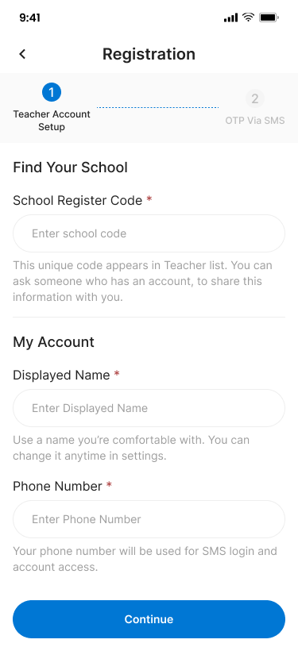
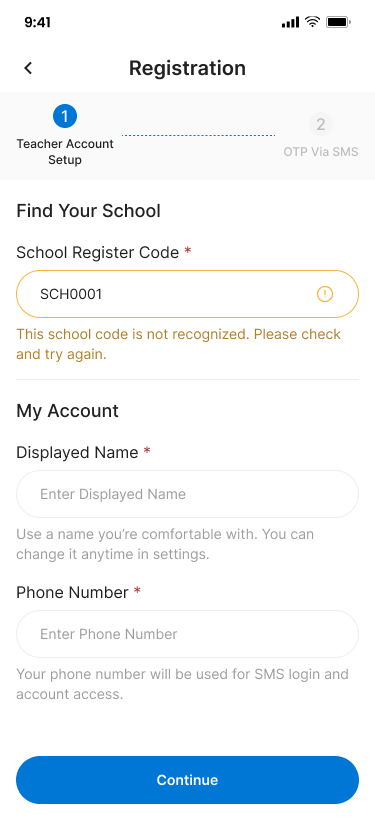
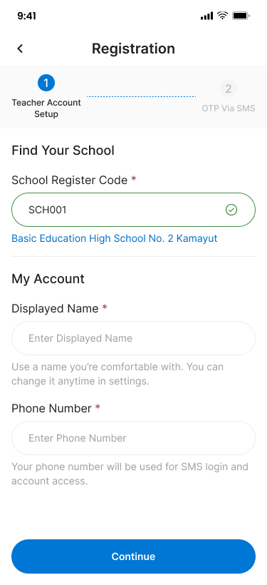
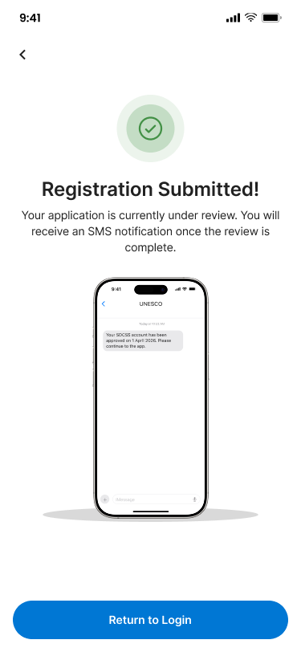

# Teacher Registration – Teacher Register







## Flow

```
┌──────────────────────┐     ┌──────────────────────┐     ┌──────────────────────┐     ┌─────────┐
│ Find School by Code  │────▶│ Teacher Account      │────▶│ OTP Verification     │────▶│ Pending │
│ + Account Info       │     │ (Continue)           │     │ (Submit)             │     │ Review  │
│ (Step 1)             │     │                      │     │ (Step 2)             │     │         │
└──────────────────────┘     └──────────────────────┘     └──────────────────────┘     └─────────┘
         │
         ▼ (Invalid code)
   ┌─────────────┐
   │ Show error: │
   │ School code │
   │ not found   │
   └─────────────┘
```

## Endpoints

- [GET `/api/v1/schools/lookup`](#1-lookup-school-by-code) — Validate school register code
- [POST `/api/v1/teacher-registrations`](#2-create-teacher-registration) — Step 1: Submit teacher info
- [POST `/api/v1/teacher-registrations/{id}/otp/request`](#3-request-otp) — Step 2: Request OTP for phone
- [POST `/api/v1/teacher-registrations/{id}/otp/verify`](#4-verify-otp) — Step 2: Verify OTP code
- [POST `/api/v1/teacher-registrations/{id}/submit`](#5-submit-registration) — Final submission

---

### 1. Lookup School by Code
**GET** `/api/v1/schools/lookup?code={code}`

Validate a school register code and return school details. Called inline when the user enters a code.

**Headers**

| Header | Value | Required |
|---|---|---|
| Content-Type | application/json | Yes |
| X-Request-ID | {{$guid}} | Yes |

**Query Parameters**

| Parameter | Type | Required | Description |
|---|---|---|---|
| code | string | Yes | School register code, e.g. SCH001 |

**Response – 200 OK**

```json
{
  "success": true,
  "data": {
    "id": "sch_001",
    "code": "SCH001",
    "name_en": "Basic Education High School No. 2 Kamayut",
    "name_mm": "အခြေခံပညာအထက်တန်းကျောင်း (၂) ကမာရွတ်",
    "status": "active"
  },
  "meta": null,
  "error": null,
  "message": "School found"
}
```

**Response – 404 Not Found**

```json
{
  "success": false,
  "data": null,
  "meta": null,
  "error": {
    "code": "SCHOOL_CODE_NOT_FOUND",
    "details": "This school code is not recognized. Please check and try again."
  },
  "message": "School code not found"
}
```

---

### 2. Create Teacher Registration
**POST** `/api/v1/teacher-registrations`

Step 1: Create a teacher registration with school code, displayed name, and phone number.

**Headers**

| Header | Value | Required |
|---|---|---|
| Content-Type | application/json | Yes |
| X-Request-ID | {{$guid}} | Yes |

**Request Body**

| Field | Type | Required | Description |
|---|---|---|---|
| school_code | string | Yes | Valid school register code |
| displayed_name | string | Yes | Name shown in the app |
| phone_number | string | Yes | E.164 format for SMS login |

```json
{
  "school_code": "SCH001",
  "displayed_name": "U Aung Kyaw",
  "phone_number": "+959123456789"
}
```

**Response – 201 Created**

```json
{
  "success": true,
  "data": {
    "id": "tch_reg_001",
    "school_id": "sch_001",
    "school_name": "Basic Education High School No. 2 Kamayut",
    "displayed_name": "U Aung Kyaw",
    "phone_number": "+959123456789",
    "status": "draft",
    "created_at": "2026-05-10T06:30:00Z"
  },
  "meta": null,
  "error": null,
  "message": "Teacher registration created"
}
```

**Response – 400 Bad Request**

```json
{
  "success": false,
  "data": null,
  "meta": null,
  "error": {
    "code": "VALIDATION_ERROR",
    "details": { "school_code": "Invalid school code" }
  },
  "message": "Validation failed"
}
```

**Response – 409 Conflict**

```json
{
  "success": false,
  "data": null,
  "meta": null,
  "error": {
    "code": "PHONE_ALREADY_USED",
    "details": "This phone number is already associated with another account"
  },
  "message": "Phone number already in use"
}
```

---

### 3. Request OTP
**POST** `/api/v1/teacher-registrations/{id}/otp/request`

Step 2: Request an OTP to verify the teacher's phone number.

**Headers**

| Header | Value | Required |
|---|---|---|
| Content-Type | application/json | Yes |
| X-Request-ID | {{$guid}} | Yes |

**Path Variables**

| Variable | Description |
|---|---|
| id | Teacher registration ID from step 1 |

**Response – 200 OK**

```json
{
  "success": true,
  "data": {
    "ref_code": "F2aR4",
    "expires_in": 300,
    "retry_after": 299
  },
  "meta": null,
  "error": null,
  "message": "OTP sent successfully"
}
```

**Response – 404 Not Found**

```json
{
  "success": false,
  "data": null,
  "meta": null,
  "error": {
    "code": "REGISTRATION_NOT_FOUND",
    "details": "Teacher registration not found"
  },
  "message": "Registration not found"
}
```

**Response – 429 Too Many Requests**

```json
{
  "success": false,
  "data": null,
  "meta": null,
  "error": {
    "code": "OTP_RATE_LIMIT",
    "details": "Please wait before requesting a new code"
  },
  "message": "Too many OTP requests"
}
```

---

### 4. Verify OTP
**POST** `/api/v1/teacher-registrations/{id}/otp/verify`

Verify the 6-digit OTP code for the teacher registration.

**Headers**

| Header | Value | Required |
|---|---|---|
| Content-Type | application/json | Yes |
| X-Request-ID | {{$guid}} | Yes |

**Path Variables**

| Variable | Description |
|---|---|
| id | Teacher registration ID |

**Request Body**

| Field | Type | Required | Description |
|---|---|---|---|
| otp_code | string | Yes | 6-digit code from SMS |
| ref_code | string | Yes | Reference code from OTP request |

```json
{
  "otp_code": "123861",
  "ref_code": "F2aR4"
}
```

**Response – 200 OK**

```json
{
  "success": true,
  "data": {
    "id": "tch_reg_001",
    "phone_verified": true,
    "status": "phone_verified"
  },
  "meta": null,
  "error": null,
  "message": "Phone verified successfully"
}
```

**Response – 400 Bad Request**

```json
{
  "success": false,
  "data": null,
  "meta": null,
  "error": {
    "code": "INVALID_OTP",
    "details": "The code is incorrect. Please try again."
  },
  "message": "Invalid OTP"
}
```

**Response – 401 Unauthorized**

```json
{
  "success": false,
  "data": null,
  "meta": null,
  "error": {
    "code": "OTP_EXPIRED",
    "details": "OTP has expired. Please request a new one."
  },
  "message": "OTP expired"
}
```

---

### 5. Submit Registration
**POST** `/api/v1/teacher-registrations/{id}/submit`

Final submission after phone verification. Status changes to `pending_review`. An SMS notification will be sent once approved.

**Headers**

| Header | Value | Required |
|---|---|---|
| Content-Type | application/json | Yes |
| X-Request-ID | {{$guid}} | Yes |

**Path Variables**

| Variable | Description |
|---|---|
| id | Teacher registration ID |

**Response – 200 OK**

```json
{
  "success": true,
  "data": {
    "id": "tch_reg_001",
    "status": "pending_review",
    "submitted_at": "2026-05-10T07:00:00Z"
  },
  "meta": null,
  "error": null,
  "message": "Registration submitted for review"
}
```

**Response – 422 Unprocessable Entity**

```json
{
  "success": false,
  "data": null,
  "meta": null,
  "error": {
    "code": "PHONE_NOT_VERIFIED",
    "details": "Phone number must be verified before submission"
  },
  "message": "Phone not verified"
}
```

## Error Codes

| Code | HTTP Status | Description |
|---|---|---|
| SCHOOL_CODE_NOT_FOUND | 404 | School register code does not exist |
| VALIDATION_ERROR | 400 | Required field missing or invalid |
| PHONE_ALREADY_USED | 409 | Phone number already registered |
| REGISTRATION_NOT_FOUND | 404 | Teacher registration ID not found |
| OTP_RATE_LIMIT | 429 | Too many OTP requests |
| INVALID_OTP | 400 | Incorrect OTP code |
| OTP_EXPIRED | 401 | OTP code has expired |
| PHONE_NOT_VERIFIED | 422 | Phone verification required before submission |
